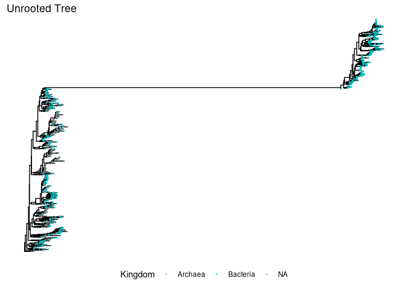
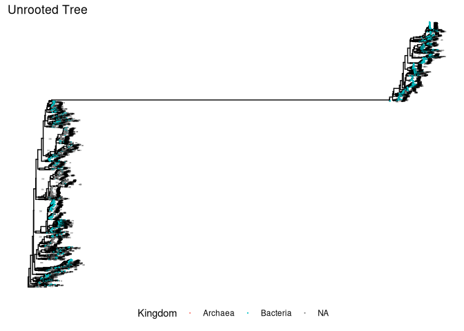
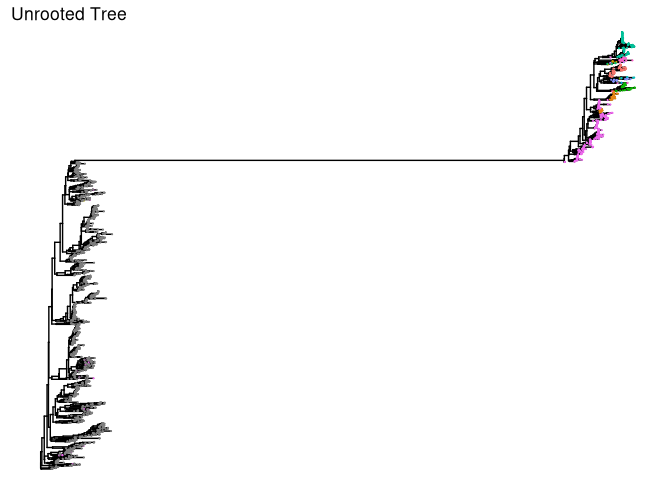
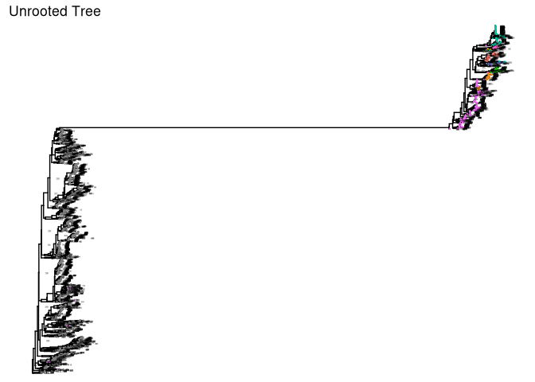
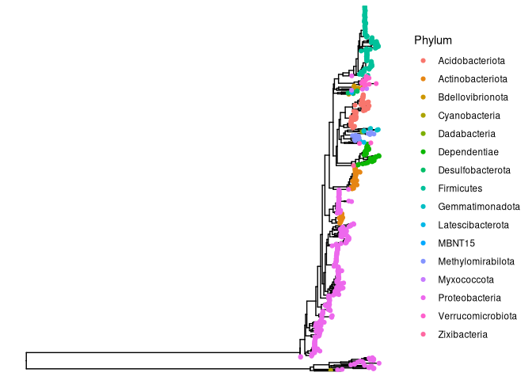

# Goals 

1. Load the fastree unrooted tree.  
2. Add tree to phyloseq object.  
3. Visualize and inspect tree with ggtree. 
4. Prune ASVs, if needed.  
5. Root our tree. 
6. Combine new tree with a phyloseq object. 
7. Save 2 phyloseq objects: 1. Unrooted tree phyloseq object, 2. Rooted tree phyloseq object. 

# Before you start

## Set my seed 

```r
# Any number can be chosen 
set.seed(238428)
```

## Load Packages 

```r
pacman::p_load(tidyverse, phyloseq, ggtree, phytools,
               install = FALSE)
```

## Load Data files 

```r
# Preprocessed phyloseq object 
load("data/02_PreProcessing/raw_preprocessed_physeq.RData")
raw_preprocessed_physeq
```

```
## phyloseq-class experiment-level object
## otu_table()   OTU Table:         [ 4531 taxa and 10 samples ]
## sample_data() Sample Data:       [ 10 samples by 10 sample variables ]
## tax_table()   Taxonomy Table:    [ 4531 taxa by 9 taxonomic ranks ]
```

```r
# Load in the tree! 
unrooted_tree <- read.tree("data/03_Phylogenetic_Tree/ASVs_unrooted.tree")
unrooted_tree
```

```
## 
## Phylogenetic tree with 4531 tips and 4529 internal nodes.
## 
## Tip labels:
##   ASV_2094, ASV_500, ASV_3335, ASV_4043, ASV_1817, ASV_2462, ...
## Node labels:
##   , 0.758, 0.976, 0.999, 0.779, 0.104, ...
## 
## Unrooted; includes branch lengths.
```

```r
str(unrooted_tree)
```

```
## List of 5
##  $ edge       : int [1:9059, 1:2] 4532 4533 4534 4535 4535 4536 4537 4538 4538 4537 ...
##  $ edge.length: num [1:9059] 0.0107 0.053 0.1021 0.0217 0.0194 ...
##  $ Nnode      : int 4529
##  $ node.label : chr [1:4529] "" "0.758" "0.976" "0.999" ...
##  $ tip.label  : chr [1:4531] "ASV_2094" "ASV_500" "ASV_3335" "ASV_4043" ...
##  - attr(*, "class")= chr "phylo"
##  - attr(*, "order")= chr "cladewise"
```


# Merge Phyloseq 

```r
# Intuition check 
stopifnot(ntaxa(raw_preprocessed_physeq) == ntaxa(unrooted_tree))

# Merge the tree with the phyloseq object 
unrooted_physeq <- 
  merge_phyloseq(raw_preprocessed_physeq, unrooted_tree)
```

```
## Found more than one class "phylo" in cache; using the first, from namespace 'phyloseq'
```

```
## Also defined by 'tidytree'
```

```
## Found more than one class "phylo" in cache; using the first, from namespace 'phyloseq'
```

```
## Also defined by 'tidytree'
```

```
## Found more than one class "phylo" in cache; using the first, from namespace 'phyloseq'
```

```
## Also defined by 'tidytree'
```

```
## Found more than one class "phylo" in cache; using the first, from namespace 'phyloseq'
```

```
## Also defined by 'tidytree'
```

```
## Found more than one class "phylo" in cache; using the first, from namespace 'phyloseq'
```

```
## Also defined by 'tidytree'
```

```
## Found more than one class "phylo" in cache; using the first, from namespace 'phyloseq'
```

```
## Also defined by 'tidytree'
```

```
## Found more than one class "phylo" in cache; using the first, from namespace 'phyloseq'
```

```
## Also defined by 'tidytree'
```

```r
unrooted_physeq
```

```
## phyloseq-class experiment-level object
## otu_table()   OTU Table:         [ 4531 taxa and 10 samples ]
## sample_data() Sample Data:       [ 10 samples by 10 sample variables ]
## tax_table()   Taxonomy Table:    [ 4531 taxa by 9 taxonomic ranks ]
## phy_tree()    Phylogenetic Tree: [ 4531 tips and 4529 internal nodes ]
```

# Plot Tree with `ggtree`

```r
# Make a basic tree
kingdom_tree <- 
  ggtree(unrooted_physeq) + 
  # color tips by kingdom 
  geom_tippoint(size = 0.1, mapping = aes(color = Kingdom)) +
  # Add title 
  labs(title = "Unrooted Tree") + 
  #move the legend to the bottom 
  theme(legend.position = "bottom"); kingdom_tree
```

<!-- -->

```r
kingdom_node_tree <- 
  kingdom_tree + 
  # Add the node label 
  geom_text(aes(label=node), hjust= -2, vjust = 1, size = 0.5)
kingdom_node_tree
```

<!-- -->

```r
phylum_tree <- 
  ggtree(unrooted_physeq) + 
  # color tips by phylum 
  geom_tippoint(size = 0.1, mapping = aes(color = Phylum)) +
  # Add title 
  labs(title = "Unrooted Tree") + 
  #move the legend to the bottom 
  theme(legend.position = "none"); phylum_tree
```

<!-- -->

```r
phylum_node_tree <- 
  phylum_tree + 
  # Add the node label 
  geom_text(aes(label=node), hjust= -2, vjust = 1, size = 0.5)
phylum_node_tree
```

<!-- -->
# Evaluate the crazy tree 
This part gets a bit manual
We will be pruning ASVs whose phylum is NA

```r
# Function from Joey McMurdie: https://github.com/joey711/phyloseq/issues/652
pop_taxa = function(physeq, badTaxa){
  allTaxa <-  taxa_names(physeq)
  allTaxa <- allTaxa[!(allTaxa %in% badTaxa)]
  return(prune_taxa(allTaxa, physeq))}

# get rid of NA phylum
no_asvs<-
  unrooted_physeq %>% 
  tax_table() %>% 
  data.frame() %>% 
  dplyr::filter(is.na(Phylum)) %>% 
  pull(ASV)

no_asvs
```

```
##  [1] "ASV_2744" "ASV_1491" "ASV_1553" "ASV_2386" "ASV_4257" "ASV_3860"
##  [7] "ASV_1327" "ASV_1232" "ASV_1495" "ASV_2210" "ASV_3557" "ASV_977" 
## [13] "ASV_1372" "ASV_1876" "ASV_1520" "ASV_3483" "ASV_1672" "ASV_2820"
## [19] "ASV_2450" "ASV_3207" "ASV_2233" "ASV_2306" "ASV_2586" "ASV_1974"
## [25] "ASV_2448" "ASV_2839" "ASV_715"  "ASV_1891" "ASV_3135" "ASV_3592"
## [31] "ASV_139"  "ASV_491"  "ASV_158"  "ASV_1421" "ASV_4385" "ASV_4096"
## [37] "ASV_2696" "ASV_1337" "ASV_1530" "ASV_4436" "ASV_4391" "ASV_2738"
## [43] "ASV_4023" "ASV_4356" "ASV_4243" "ASV_4393" "ASV_1612" "ASV_4307"
## [49] "ASV_4442" "ASV_4274" "ASV_3836" "ASV_4324" "ASV_3821" "ASV_1653"
## [55] "ASV_1804" "ASV_2292" "ASV_3730" "ASV_3990" "ASV_2962" "ASV_3276"
## [61] "ASV_4439" "ASV_1943" "ASV_4140" "ASV_4333" "ASV_2785" "ASV_2573"
## [67] "ASV_1964" "ASV_2845" "ASV_3729" "ASV_362"  "ASV_3206" "ASV_4394"
## [73] "ASV_4329" "ASV_3991" "ASV_4362" "ASV_3151" "ASV_3966" "ASV_4288"
## [79] "ASV_4434" "ASV_4515" "ASV_4453" "ASV_4388" "ASV_4347" "ASV_4509"
## [85] "ASV_4510" "ASV_4451" "ASV_4280" "ASV_4036" "ASV_3054" "ASV_3965"
## [91] "ASV_4413" "ASV_4220" "ASV_4210"
```

```r
# Function from Joey McMurdie: https://github.com/joey711/phyloseq/issues/652
pop_taxa = function(physeq, badTaxa){
  allTaxa <-  taxa_names(physeq)
  allTaxa <- allTaxa[!(allTaxa %in% badTaxa)]
  return(prune_taxa(allTaxa, physeq))}

# Let's use the pop_taxa function :) 
# Recreate a phyloseq object without ASV_456
unrooted_physeq_rmNA <- 
  unrooted_physeq %>%
  pop_taxa(., no_asvs)
```

```
## Found more than one class "phylo" in cache; using the first, from namespace 'phyloseq'
```

```
## Also defined by 'tidytree'
```

```r
#intiution check
ntaxa(unrooted_physeq) - ntaxa(unrooted_physeq_rmNA)
```

```
## [1] 93
```


# Midroot Tree

```r
# Is the tree rooted?
new_unrooted_tree <-phy_tree(unrooted_physeq_rmNA)
is.rooted(new_unrooted_tree)
```

```
## [1] FALSE
```

```r
# Let's midpoint root the tree
midpoint_rooted_tree <- midpoint.root(new_unrooted_tree)

# Is the new tree rooted?
is.rooted(midpoint_rooted_tree)
```

```
## [1] TRUE
```

```r
# Assign to a new phyloseq object: merging subsetted phyloseq with the new rooted tree

# Merge tree 
midroot_physeq <- 
  merge_phyloseq(raw_preprocessed_physeq, midpoint_rooted_tree)
```

```
## Found more than one class "phylo" in cache; using the first, from namespace 'phyloseq'
```

```
## Also defined by 'tidytree'
```

```
## Found more than one class "phylo" in cache; using the first, from namespace 'phyloseq'
```

```
## Also defined by 'tidytree'
```

```
## Found more than one class "phylo" in cache; using the first, from namespace 'phyloseq'
```

```
## Also defined by 'tidytree'
```

```
## Found more than one class "phylo" in cache; using the first, from namespace 'phyloseq'
```

```
## Also defined by 'tidytree'
```

```r
midroot_physeq
```

```
## phyloseq-class experiment-level object
## otu_table()   OTU Table:         [ 4438 taxa and 10 samples ]
## sample_data() Sample Data:       [ 10 samples by 10 sample variables ]
## tax_table()   Taxonomy Table:    [ 4438 taxa by 9 taxonomic ranks ]
## phy_tree()    Phylogenetic Tree: [ 4438 tips and 4437 internal nodes ]
```

```r
# Quick inspection of tree 
ggtree(midroot_physeq) + 
  geom_tippoint(mapping = aes(color = Phylum))
```

<!-- -->


# Save to a new phyloseq object

```r
# Save both phyloseq objects with our tree object to one .RData file 
save(list = c("unrooted_physeq", "midroot_physeq"),
     file = "data/03_Phylogenetic_Tree/phytree_preprocessed_physeq.RData")
```

# Session Information 

```r
# Ensure reproducibility 
devtools::session_info()
```

```
## ─ Session info ───────────────────────────────────────────────────────────────
##  setting  value
##  version  R version 4.3.2 (2023-10-31)
##  os       Rocky Linux 9.0 (Blue Onyx)
##  system   x86_64, linux-gnu
##  ui       X11
##  language (EN)
##  collate  en_US.UTF-8
##  ctype    en_US.UTF-8
##  tz       America/New_York
##  date     2024-04-30
##  pandoc   3.1.1 @ /usr/lib/rstudio-server/bin/quarto/bin/tools/ (via rmarkdown)
## 
## ─ Packages ───────────────────────────────────────────────────────────────────
##  package           * version    date (UTC) lib source
##  ade4                1.7-22     2023-02-06 [1] CRAN (R 4.3.2)
##  ape               * 5.7-1      2023-03-13 [2] CRAN (R 4.3.2)
##  aplot               0.2.2      2023-10-06 [1] CRAN (R 4.3.2)
##  Biobase             2.62.0     2023-10-24 [2] Bioconductor
##  BiocGenerics        0.48.1     2023-11-01 [2] Bioconductor
##  biomformat          1.30.0     2023-10-24 [1] Bioconductor
##  Biostrings          2.70.1     2023-10-25 [2] Bioconductor
##  bitops              1.0-7      2021-04-24 [2] CRAN (R 4.3.2)
##  bslib               0.5.1      2023-08-11 [2] CRAN (R 4.3.2)
##  cachem              1.0.8      2023-05-01 [2] CRAN (R 4.3.2)
##  callr               3.7.3      2022-11-02 [2] CRAN (R 4.3.2)
##  cli                 3.6.1      2023-03-23 [2] CRAN (R 4.3.2)
##  cluster             2.1.4      2022-08-22 [2] CRAN (R 4.3.2)
##  clusterGeneration   1.3.8      2023-08-16 [1] CRAN (R 4.3.2)
##  coda                0.19-4     2020-09-30 [2] CRAN (R 4.3.2)
##  codetools           0.2-19     2023-02-01 [2] CRAN (R 4.3.2)
##  colorspace          2.1-0      2023-01-23 [2] CRAN (R 4.3.2)
##  combinat            0.0-8      2012-10-29 [1] CRAN (R 4.3.2)
##  crayon              1.5.2      2022-09-29 [2] CRAN (R 4.3.2)
##  data.table          1.14.8     2023-02-17 [2] CRAN (R 4.3.2)
##  devtools            2.4.4      2022-07-20 [2] CRAN (R 4.2.1)
##  digest              0.6.33     2023-07-07 [2] CRAN (R 4.3.2)
##  doParallel          1.0.17     2022-02-07 [2] CRAN (R 4.3.2)
##  dplyr             * 1.1.3      2023-09-03 [2] CRAN (R 4.3.2)
##  ellipsis            0.3.2      2021-04-29 [2] CRAN (R 4.3.2)
##  evaluate            0.23       2023-11-01 [2] CRAN (R 4.3.2)
##  expm                0.999-9    2024-01-11 [1] CRAN (R 4.3.2)
##  fansi               1.0.5      2023-10-08 [2] CRAN (R 4.3.2)
##  farver              2.1.1      2022-07-06 [2] CRAN (R 4.3.2)
##  fastmap             1.1.1      2023-02-24 [2] CRAN (R 4.3.2)
##  fastmatch           1.1-4      2023-08-18 [1] CRAN (R 4.3.2)
##  forcats           * 1.0.0      2023-01-29 [1] CRAN (R 4.3.2)
##  foreach             1.5.2      2022-02-02 [2] CRAN (R 4.3.2)
##  fs                  1.6.3      2023-07-20 [2] CRAN (R 4.3.2)
##  generics            0.1.3      2022-07-05 [2] CRAN (R 4.3.2)
##  GenomeInfoDb        1.38.0     2023-10-24 [2] Bioconductor
##  GenomeInfoDbData    1.2.11     2023-11-07 [2] Bioconductor
##  ggfun               0.1.4      2024-01-19 [1] CRAN (R 4.3.2)
##  ggplot2           * 3.5.0      2024-02-23 [2] CRAN (R 4.3.2)
##  ggplotify           0.1.2      2023-08-09 [1] CRAN (R 4.3.2)
##  ggtree            * 3.10.1     2024-02-25 [1] Bioconductor 3.18 (R 4.3.2)
##  glue                1.6.2      2022-02-24 [2] CRAN (R 4.3.2)
##  gridGraphics        0.5-1      2020-12-13 [1] CRAN (R 4.3.2)
##  gtable              0.3.4      2023-08-21 [2] CRAN (R 4.3.2)
##  highr               0.10       2022-12-22 [2] CRAN (R 4.3.2)
##  hms                 1.1.3      2023-03-21 [1] CRAN (R 4.3.2)
##  htmltools           0.5.7      2023-11-03 [2] CRAN (R 4.3.2)
##  htmlwidgets         1.6.2      2023-03-17 [2] CRAN (R 4.3.2)
##  httpuv              1.6.12     2023-10-23 [2] CRAN (R 4.3.2)
##  igraph              1.5.1      2023-08-10 [2] CRAN (R 4.3.2)
##  IRanges             2.36.0     2023-10-24 [2] Bioconductor
##  iterators           1.0.14     2022-02-05 [2] CRAN (R 4.3.2)
##  jquerylib           0.1.4      2021-04-26 [2] CRAN (R 4.3.2)
##  jsonlite            1.8.7      2023-06-29 [2] CRAN (R 4.3.2)
##  knitr               1.45       2023-10-30 [2] CRAN (R 4.3.2)
##  labeling            0.4.3      2023-08-29 [2] CRAN (R 4.3.2)
##  later               1.3.1      2023-05-02 [2] CRAN (R 4.3.2)
##  lattice             0.21-9     2023-10-01 [2] CRAN (R 4.3.2)
##  lazyeval            0.2.2      2019-03-15 [2] CRAN (R 4.3.2)
##  lifecycle           1.0.3      2022-10-07 [2] CRAN (R 4.3.2)
##  lubridate         * 1.9.3      2023-09-27 [1] CRAN (R 4.3.2)
##  magrittr            2.0.3      2022-03-30 [2] CRAN (R 4.3.2)
##  maps              * 3.4.2      2023-12-15 [1] CRAN (R 4.3.2)
##  MASS                7.3-60     2023-05-04 [2] CRAN (R 4.3.2)
##  Matrix              1.6-1.1    2023-09-18 [2] CRAN (R 4.3.2)
##  memoise             2.0.1      2021-11-26 [2] CRAN (R 4.3.2)
##  mgcv                1.9-0      2023-07-11 [2] CRAN (R 4.3.2)
##  mime                0.12       2021-09-28 [2] CRAN (R 4.3.2)
##  miniUI              0.1.1.1    2018-05-18 [2] CRAN (R 4.3.2)
##  mnormt              2.1.1      2022-09-26 [1] CRAN (R 4.3.2)
##  multtest            2.58.0     2023-10-24 [1] Bioconductor
##  munsell             0.5.0      2018-06-12 [2] CRAN (R 4.3.2)
##  nlme                3.1-163    2023-08-09 [2] CRAN (R 4.3.2)
##  numDeriv            2016.8-1.1 2019-06-06 [1] CRAN (R 4.3.2)
##  optimParallel       1.0-2      2021-02-11 [1] CRAN (R 4.3.2)
##  pacman              0.5.1      2019-03-11 [1] CRAN (R 4.3.2)
##  patchwork           1.2.0.9000 2024-03-11 [1] Github (thomasp85/patchwork@d943757)
##  permute             0.9-7      2022-01-27 [1] CRAN (R 4.3.2)
##  phangorn            2.11.1     2023-01-23 [1] CRAN (R 4.3.2)
##  phyloseq          * 1.46.0     2023-10-24 [1] Bioconductor
##  phytools          * 2.1-1      2024-01-09 [1] CRAN (R 4.3.2)
##  pillar              1.9.0      2023-03-22 [2] CRAN (R 4.3.2)
##  pkgbuild            1.4.2      2023-06-26 [2] CRAN (R 4.3.2)
##  pkgconfig           2.0.3      2019-09-22 [2] CRAN (R 4.3.2)
##  pkgload             1.3.3      2023-09-22 [2] CRAN (R 4.3.2)
##  plyr                1.8.9      2023-10-02 [2] CRAN (R 4.3.2)
##  prettyunits         1.2.0      2023-09-24 [2] CRAN (R 4.3.2)
##  processx            3.8.2      2023-06-30 [2] CRAN (R 4.3.2)
##  profvis             0.3.8      2023-05-02 [2] CRAN (R 4.3.2)
##  promises            1.2.1      2023-08-10 [2] CRAN (R 4.3.2)
##  ps                  1.7.5      2023-04-18 [2] CRAN (R 4.3.2)
##  purrr             * 1.0.2      2023-08-10 [2] CRAN (R 4.3.2)
##  quadprog            1.5-8      2019-11-20 [1] CRAN (R 4.3.2)
##  R6                  2.5.1      2021-08-19 [2] CRAN (R 4.3.2)
##  Rcpp                1.0.11     2023-07-06 [2] CRAN (R 4.3.2)
##  RCurl               1.98-1.14  2024-01-09 [1] CRAN (R 4.3.2)
##  readr             * 2.1.5      2024-01-10 [1] CRAN (R 4.3.2)
##  remotes             2.4.2.1    2023-07-18 [2] CRAN (R 4.3.2)
##  reshape2            1.4.4      2020-04-09 [2] CRAN (R 4.3.2)
##  rhdf5               2.46.1     2023-11-29 [1] Bioconductor 3.18 (R 4.3.2)
##  rhdf5filters        1.14.1     2023-11-06 [1] Bioconductor
##  Rhdf5lib            1.24.2     2024-02-07 [1] Bioconductor 3.18 (R 4.3.2)
##  rlang               1.1.2      2023-11-04 [2] CRAN (R 4.3.2)
##  rmarkdown           2.25       2023-09-18 [2] CRAN (R 4.3.2)
##  rstudioapi          0.15.0     2023-07-07 [2] CRAN (R 4.3.2)
##  S4Vectors           0.40.1     2023-10-26 [2] Bioconductor
##  sass                0.4.7      2023-07-15 [2] CRAN (R 4.3.2)
##  scales              1.3.0      2023-11-28 [2] CRAN (R 4.3.2)
##  scatterplot3d       0.3-44     2023-05-05 [1] CRAN (R 4.3.2)
##  sessioninfo         1.2.2      2021-12-06 [2] CRAN (R 4.3.2)
##  shiny               1.7.5.1    2023-10-14 [2] CRAN (R 4.3.2)
##  stringi             1.7.12     2023-01-11 [2] CRAN (R 4.3.2)
##  stringr           * 1.5.0      2022-12-02 [2] CRAN (R 4.3.2)
##  survival            3.5-7      2023-08-14 [2] CRAN (R 4.3.2)
##  tibble            * 3.2.1      2023-03-20 [2] CRAN (R 4.3.2)
##  tidyr             * 1.3.0      2023-01-24 [2] CRAN (R 4.3.2)
##  tidyselect          1.2.1      2024-03-11 [1] CRAN (R 4.3.2)
##  tidytree            0.4.6      2023-12-12 [1] CRAN (R 4.3.2)
##  tidyverse         * 2.0.0      2023-02-22 [1] CRAN (R 4.3.2)
##  timechange          0.3.0      2024-01-18 [1] CRAN (R 4.3.2)
##  treeio              1.26.0     2023-10-24 [1] Bioconductor
##  tzdb                0.4.0      2023-05-12 [1] CRAN (R 4.3.2)
##  urlchecker          1.0.1      2021-11-30 [2] CRAN (R 4.3.2)
##  usethis             2.2.2      2023-07-06 [2] CRAN (R 4.3.2)
##  utf8                1.2.4      2023-10-22 [2] CRAN (R 4.3.2)
##  vctrs               0.6.4      2023-10-12 [2] CRAN (R 4.3.2)
##  vegan               2.6-4      2022-10-11 [1] CRAN (R 4.3.2)
##  withr               2.5.2      2023-10-30 [2] CRAN (R 4.3.2)
##  xfun                0.41       2023-11-01 [2] CRAN (R 4.3.2)
##  xtable              1.8-4      2019-04-21 [2] CRAN (R 4.3.2)
##  XVector             0.42.0     2023-10-24 [2] Bioconductor
##  yaml                2.3.7      2023-01-23 [2] CRAN (R 4.3.2)
##  yulab.utils         0.1.4      2024-01-28 [1] CRAN (R 4.3.2)
##  zlibbioc            1.48.0     2023-10-24 [2] Bioconductor
## 
##  [1] /home/sna49/R/x86_64-pc-linux-gnu-library/4.3
##  [2] /programs/R-4.3.2/library
## 
## ──────────────────────────────────────────────────────────────────────────────
```
