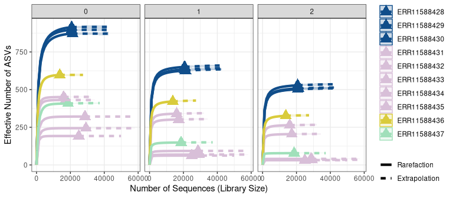
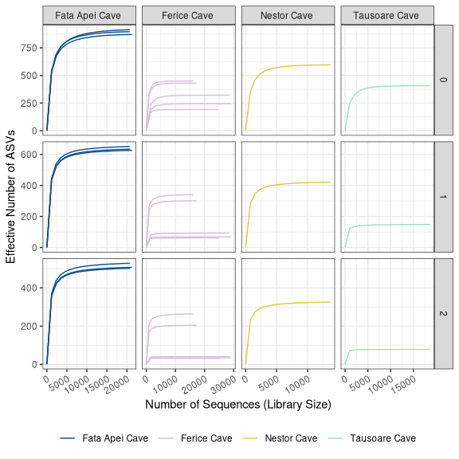
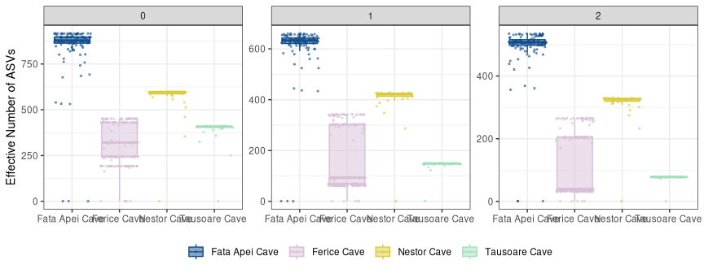

# Setting the Environment 

## Set the seed 

```r
set.seed(09091999)
```

## Load Libraries 

```r
pacman::p_load(tidyverse, devtools, patchwork, iNEXT, phyloseq,
               install = FALSE)
```

## Load in Data 

```r
load("/local/workdir/sna49/moon_milk/moonmilk/data/02_PreProcessing/raw_preprocessed_physeq.RData")
raw_preprocessed_physeq
```

```
## phyloseq-class experiment-level object
## otu_table()   OTU Table:         [ 2138 taxa and 10 samples ]
## sample_data() Sample Data:       [ 10 samples by 10 sample variables ]
## tax_table()   Taxonomy Table:    [ 2138 taxa by 9 taxonomic ranks ]
```

```r
# Intiution Check 
min(sample_sums(raw_preprocessed_physeq))
```

```
## [1] 2956
```

```r
# Make metadata dataframe
metadata_df <-
  raw_preprocessed_physeq %>%
  sample_data() %>%
  data.frame()

#View(metadata_df)

# Setting colors for caves
cave_colors <- c(
  "Fata Apei Cave " = "dodgerblue4",
  "Ferice Cave " = "#D8BFD8",
  "Nestor Cave " = "#D9CC3C",
  "Tausoare Cave " = "#A0E0BA")
```


# Goals

1. Calculate the Hill Diversity of the samples. 
2. Evaluate the rarefaction curves. 
3. Evaluate the Diversity values. 
4. Makes notes of specific samples and their seq depth. 

# Diversity Calculations with iNEXT 


```r
# prepare input data 
iNEXT_input_df <- 
  raw_preprocessed_physeq %>%
  otu_table() %>%
  data.frame()

# Quick check
dim(iNEXT_input_df)
```

```
## [1] 2138   10
```

```r
# Run iNEXT: Calculate the Hill Numbers 
# Note that: Species in ROWS, Samples in COLUMNS 
# Remember to set the seed! 

iNEXT_data <- iNEXT(iNEXT_input_df, 
                    q = c(0,1,2), datatype = "abundance")

# Save the file
save(iNEXT_data, file = "/local/workdir/sna49/moon_milk/moonmilk/data/04_Biodiversity/iNEXT_data.RData")
```

# Evaluate the Diversity! 

```r
load("/local/workdir/sna49/moon_milk/moonmilk/data/04_Biodiversity/iNEXT_data.RData")
str(iNEXT_data)
```

```
## List of 3
##  $ DataInfo:'data.frame':	10 obs. of  14 variables:
##   ..$ Assemblage: chr [1:10] "ERR11588428" "ERR11588429" "ERR11588430" "ERR11588431" ...
##   ..$ n         : num [1:10] 11886 11971 11716 3005 5515 ...
##   ..$ S.obs     : num [1:10] 479 508 466 110 183 89 181 148 194 179
##   ..$ SC        : num [1:10] 0.999 0.998 0.999 1 1 ...
##   ..$ f1        : num [1:10] 13 23 16 0 0 0 2 0 17 6
##   ..$ f2        : num [1:10] 35 30 23 0 0 0 2 3 13 1
##   ..$ f3        : num [1:10] 18 9 8 0 1 0 1 2 5 4
##   ..$ f4        : num [1:10] 13 15 9 0 8 0 7 2 3 6
##   ..$ f5        : num [1:10] 18 24 17 1 7 0 0 5 3 6
##   ..$ f6        : num [1:10] 11 13 10 4 8 1 1 3 3 8
##   ..$ f7        : num [1:10] 6 11 10 1 3 0 4 5 5 3
##   ..$ f8        : num [1:10] 10 16 13 7 5 0 5 5 7 5
##   ..$ f9        : num [1:10] 9 11 10 2 7 1 1 5 7 4
##   ..$ f10       : num [1:10] 14 10 13 1 6 1 4 1 8 9
##  $ iNextEst:List of 2
##   ..$ size_based    :'data.frame':	1200 obs. of  10 variables:
##   .. ..$ Assemblage: chr [1:1200] "ERR11588428" "ERR11588428" "ERR11588428" "ERR11588428" ...
##   .. ..$ m         : num [1:1200] 1 661 1321 1981 2641 ...
##   .. ..$ Method    : chr [1:1200] "Rarefaction" "Rarefaction" "Rarefaction" "Rarefaction" ...
##   .. ..$ Order.q   : num [1:1200] 0 0 0 0 0 0 0 0 0 0 ...
##   .. ..$ qD        : num [1:1200] 1 294 367 400 420 ...
##   .. ..$ qD.LCL    : num [1:1200] 1 291 364 397 416 ...
##   .. ..$ qD.UCL    : num [1:1200] 1 296 370 404 423 ...
##   .. ..$ SC        : num [1:1200] 0.00341 0.81766 0.93133 0.96341 0.9767 ...
##   .. ..$ SC.LCL    : num [1:1200] 0.00334 0.81507 0.92979 0.96203 0.97551 ...
##   .. ..$ SC.UCL    : num [1:1200] 0.00348 0.82026 0.93288 0.96479 0.97789 ...
##   ..$ coverage_based:'data.frame':	948 obs. of  8 variables:
##   .. ..$ Assemblage: chr [1:948] "ERR11588428" "ERR11588428" "ERR11588428" "ERR11588428" ...
##   .. ..$ SC        : num [1:948] 0.00341 0.81766 0.93133 0.96341 0.9767 ...
##   .. ..$ m         : num [1:948] 1 661 1321 1981 2641 ...
##   .. ..$ Method    : chr [1:948] "Rarefaction" "Rarefaction" "Rarefaction" "Rarefaction" ...
##   .. ..$ Order.q   : num [1:948] 0 0 0 0 0 0 0 0 0 0 ...
##   .. ..$ qD        : num [1:948] 1 294 367 400 420 ...
##   .. ..$ qD.LCL    : num [1:948] 0.999 289.99 363.55 396.06 414.78 ...
##   .. ..$ qD.UCL    : num [1:948] 1 297 371 405 424 ...
##  $ AsyEst  :'data.frame':	30 obs. of  7 variables:
##   ..$ Assemblage: chr [1:30] "ERR11588428" "ERR11588428" "ERR11588428" "ERR11588429" ...
##   ..$ Diversity : chr [1:30] "Species richness" "Shannon diversity" "Simpson diversity" "Species richness" ...
##   ..$ Observed  : num [1:30] 479 343 286 508 357 ...
##   ..$ Estimator : num [1:30] 481 350 293 517 365 ...
##   ..$ s.e.      : num [1:30] 7 2.53 3.08 7.88 2.35 ...
##   ..$ LCL       : num [1:30] 479 345 287 508 360 ...
##   ..$ UCL       : num [1:30] 495 355 299 532 369 ...
##  - attr(*, "class")= chr "iNEXT"
```

```r
typeof(iNEXT_data)
```

```
## [1] "list"
```

# Plot Diversity 

```r
# Prepare Colors 
color_df <- 
  iNEXT_input_df %>%
  colnames() %>%
  data.frame()
# Check
head(color_df)
```

```
##             .
## 1 ERR11588428
## 2 ERR11588429
## 3 ERR11588430
## 4 ERR11588431
## 5 ERR11588432
## 6 ERR11588433
```

```r
# Rename the column 
colnames(color_df)[1] <- "names"
# Check
head(color_df)
```

```
##         names
## 1 ERR11588428
## 2 ERR11588429
## 3 ERR11588430
## 4 ERR11588431
## 5 ERR11588432
## 6 ERR11588433
```

```r
# Make a helper dataframe for plotting with colors 
iNEXT_color_df <- 
  color_df %>%
  # Merge with metadata
  left_join(metadata_df, by = "names") %>%
  # Merge with colors for plotting with ggiNEXT
  left_join(data.frame(cave_colors = cave_colors,
            cave = names(cave_colors)),
            by = "cave")
```

# Plot Rarefaction with `ggiNEXT`


```r
# Plot rarefaction! 
# rarefaction/extrapolation curve, type = 1 

# Order q: 
  # 0 = Richness/ Number of Total taxa
  # 1 = Exponential Shannon / Number of "Common" taxa
  # 2 = Inverse Simpson / Number of "Dominant" taxa 

ggiNEXT(iNEXT_data, type = 1, facet.var = "Order.q") + 
  facet_wrap(~Order.q, scales = "fixed") + 
  scale_color_manual(values = iNEXT_color_df$cave_colors, guide = FALSE) + 
  scale_fill_manual(values = iNEXT_color_df$cave_colors, guide = FALSE) + 
  scale_shape_manual(values = base::rep(17, nsamples(raw_preprocessed_physeq)),
                     guide = FALSE) +
  labs(x = "Number of Sequences (Library Size)", 
       y = "Effective Number of ASVs") + 
  theme_bw() 
```

```
## Scale for colour is already present.
## Adding another scale for colour, which will replace the existing scale.
## Scale for fill is already present.
## Adding another scale for fill, which will replace the existing scale.
```



Remembering that an Order q of:  

  - 0 = Richness/ Number of Total taxa
  - 1 = Exponential Shannon / Number of "Common" taxa
  - 2 = Inverse Simpson / Number of "Dominant" taxa 
  
*Also note that iNEXT will extrapolate the number of sequences to double the sequencing depth of the sample!*

Finally, let's draw some conclusions from the plot above (we discussed in class & I'll summarize here):  

1. The best gift of a diversity measure: *All three diversity measures are on the same x-axis: The Effective Number of Species.*  
2. As q increases from 0 to 1 to 2, the abundance of the species is weighted more, so the rarefaction curve platueaus earlier. **This is important because it indicates that richess is the most sensitive to sequencing depth!** However, Shannon and even less sensitive is Simpson!  
3. Most of the sample rarefaction curves appear to plateau but we need to look deeper.  
4. There appears to be a sample with much lower richness than the rest of the dataset. Let's keep our eyes on this sample...  


In your analysis, please provide a clear description! 

# Manually plot Diversity 

## Rarefaction

```r
iNEXT_manual_df <- 
  iNEXT_data$iNextEst$size_based %>%
  dplyr::rename(names = Assemblage) %>%
  # Fix the samples names 
  # join with metadata 
  left_join(., metadata_df, by = "names") %>%
  # Add colors to data frame
  left_join(., data.frame(cave_colors = cave_colors,
                          cave = names(cave_colors)),
            by = "cave") 
# Inspect 
dim(iNEXT_manual_df)
```

```
## [1] 1200   20
```

```r
str(iNEXT_manual_df)
```

```
## 'data.frame':	1200 obs. of  20 variables:
##  $ names              : chr  "ERR11588428" "ERR11588428" "ERR11588428" "ERR11588428" ...
##  $ m                  : num  1 661 1321 1981 2641 ...
##  $ Method             : chr  "Rarefaction" "Rarefaction" "Rarefaction" "Rarefaction" ...
##  $ Order.q            : num  0 0 0 0 0 0 0 0 0 0 ...
##  $ qD                 : num  1 294 367 400 420 ...
##  $ qD.LCL             : num  1 291 364 397 416 ...
##  $ qD.UCL             : num  1 296 370 404 423 ...
##  $ SC                 : num  0.00341 0.81766 0.93133 0.96341 0.9767 ...
##  $ SC.LCL             : num  0.00334 0.81507 0.92979 0.96203 0.97551 ...
##  $ SC.UCL             : num  0.00348 0.82026 0.93288 0.96479 0.97789 ...
##  $ input              : num  96845 96845 96845 96845 96845 ...
##  $ filtered           : num  58385 58385 58385 58385 58385 ...
##  $ denoisedF          : num  53663 53663 53663 53663 53663 ...
##  $ denoisedR          : num  54456 54456 54456 54456 54456 ...
##  $ merged             : num  40228 40228 40228 40228 40228 ...
##  $ nochim             : num  11916 11916 11916 11916 11916 ...
##  $ perc_reads_retained: num  12.3 12.3 12.3 12.3 12.3 ...
##  $ cave               : chr  "Fata Apei Cave " "Fata Apei Cave " "Fata Apei Cave " "Fata Apei Cave " ...
##  $ sample             : chr  " FA_1" " FA_1" " FA_1" " FA_1" ...
##  $ cave_colors        : chr  "dodgerblue4" "dodgerblue4" "dodgerblue4" "dodgerblue4" ...
```

```r
# Plot it - Rarefaction Curve 
iNEXT_manual_df %>%
  # Filter out rows that are calcaulted by rarefaction from iNEXT
  dplyr::filter(Method == "Rarefaction") %>%
  # Now, let's draw the plot, be sure to group by the samples if using geom_line!
  ggplot(aes(x = m, y= qD, color = cave, group = names)) + 
  geom_line() + 
  # Facet with the station to see the samples better 
  facet_grid(Order.q~cave, scales = "free") + 
  scale_color_manual(values = cave_colors) + 
  labs(x = "Number of Sequences (Library Size)", 
       y = "Effective Number of ASVs") + 
  theme_bw() + 
  #guides(color = guide_legend(nrow = 2, byrow = TRUE)) + 
  theme(legend.position = "bottom",
        axis.text.x = element_text(angle = 30, vjust = 1, hjust = 1),
        legend.title = element_blank()) 
```




While the rarefaction curves from `ggiNEXT` agglomerated the data together, it was hard to see individual samples. Above, we can start to tease apart specific samples within each station that appear higher. 

*Please interpret your results!!*

Some take-aways:  

- Richness:  
    - The richness is higher in Feta Apei
    - all the other caves have similar but lower richness
    
- Shannon:
  - 
    
- Simpson's Diversity:  
    - Again Feta Apei had the highest simpsons diversity meaning that there are more rare taxa 
    
- Shannon Diversity
  - Feta Apei had the highest Shannon 
  - Tausoare had the loweset Shannon than the other caves

# Boxplots of Diversity 

Now, let's zoom in on a bit of a better view of the data by visualizing it in a boxplot...  


```r
# Boxplots by station 
iNEXT_manual_df %>%
  ggplot(aes(x = cave, y = qD, fill = cave, color = cave)) + 
  facet_wrap(~Order.q, scales = "free") + 
  geom_jitter(size = 0.5, alpha = 0.5) + 
  geom_boxplot(alpha = 0.5, outlier.shape = NA) + 
  scale_color_manual(values = cave_colors) + 
  scale_fill_manual(values = cave_colors) + 
  labs(y = "Effective Number of ASVs") + 
  theme_bw() +
  theme(legend.position = "bottom",
        axis.title.x = element_blank(),
        legend.title = element_blank())
```



We can draw that:  

- Richness is different between stations it looks significant but we need to tst. Fata Apei has the highest richness. The other caves have similar richness. 

- Across teh board Fata Apei has the highest Richness, Shannon, and Simpson

- Ferice cave apears to have the most variation 
- The lowest shannon and simpson are tausoare indicating that theres fewr common/dominant taxa in comparision to other communities 
 
# Environmental Variable Check 
We do not have environmental data 


# Session Information

```r
devtools::session_info()
```

```
## ─ Session info ───────────────────────────────────────────────────────────────
##  setting  value
##  version  R version 4.3.2 (2023-10-31)
##  os       Rocky Linux 9.0 (Blue Onyx)
##  system   x86_64, linux-gnu
##  ui       X11
##  language (EN)
##  collate  en_US.UTF-8
##  ctype    en_US.UTF-8
##  tz       America/New_York
##  date     2024-04-29
##  pandoc   3.1.1 @ /usr/lib/rstudio-server/bin/quarto/bin/tools/ (via rmarkdown)
## 
## ─ Packages ───────────────────────────────────────────────────────────────────
##  package          * version    date (UTC) lib source
##  ade4               1.7-22     2023-02-06 [1] CRAN (R 4.3.2)
##  ape                5.7-1      2023-03-13 [2] CRAN (R 4.3.2)
##  Biobase            2.62.0     2023-10-24 [2] Bioconductor
##  BiocGenerics       0.48.1     2023-11-01 [2] Bioconductor
##  biomformat         1.30.0     2023-10-24 [1] Bioconductor
##  Biostrings         2.70.1     2023-10-25 [2] Bioconductor
##  bitops             1.0-7      2021-04-24 [2] CRAN (R 4.3.2)
##  bslib              0.5.1      2023-08-11 [2] CRAN (R 4.3.2)
##  cachem             1.0.8      2023-05-01 [2] CRAN (R 4.3.2)
##  callr              3.7.3      2022-11-02 [2] CRAN (R 4.3.2)
##  cli                3.6.1      2023-03-23 [2] CRAN (R 4.3.2)
##  cluster            2.1.4      2022-08-22 [2] CRAN (R 4.3.2)
##  codetools          0.2-19     2023-02-01 [2] CRAN (R 4.3.2)
##  colorspace         2.1-0      2023-01-23 [2] CRAN (R 4.3.2)
##  crayon             1.5.2      2022-09-29 [2] CRAN (R 4.3.2)
##  data.table         1.14.8     2023-02-17 [2] CRAN (R 4.3.2)
##  devtools         * 2.4.4      2022-07-20 [2] CRAN (R 4.2.1)
##  digest             0.6.33     2023-07-07 [2] CRAN (R 4.3.2)
##  dplyr            * 1.1.3      2023-09-03 [2] CRAN (R 4.3.2)
##  ellipsis           0.3.2      2021-04-29 [2] CRAN (R 4.3.2)
##  evaluate           0.23       2023-11-01 [2] CRAN (R 4.3.2)
##  fansi              1.0.5      2023-10-08 [2] CRAN (R 4.3.2)
##  farver             2.1.1      2022-07-06 [2] CRAN (R 4.3.2)
##  fastmap            1.1.1      2023-02-24 [2] CRAN (R 4.3.2)
##  forcats          * 1.0.0      2023-01-29 [1] CRAN (R 4.3.2)
##  foreach            1.5.2      2022-02-02 [2] CRAN (R 4.3.2)
##  fs                 1.6.3      2023-07-20 [2] CRAN (R 4.3.2)
##  generics           0.1.3      2022-07-05 [2] CRAN (R 4.3.2)
##  GenomeInfoDb       1.38.0     2023-10-24 [2] Bioconductor
##  GenomeInfoDbData   1.2.11     2023-11-07 [2] Bioconductor
##  ggplot2          * 3.5.0      2024-02-23 [2] CRAN (R 4.3.2)
##  glue               1.6.2      2022-02-24 [2] CRAN (R 4.3.2)
##  gtable             0.3.4      2023-08-21 [2] CRAN (R 4.3.2)
##  highr              0.10       2022-12-22 [2] CRAN (R 4.3.2)
##  hms                1.1.3      2023-03-21 [1] CRAN (R 4.3.2)
##  htmltools          0.5.7      2023-11-03 [2] CRAN (R 4.3.2)
##  htmlwidgets        1.6.2      2023-03-17 [2] CRAN (R 4.3.2)
##  httpuv             1.6.12     2023-10-23 [2] CRAN (R 4.3.2)
##  igraph             1.5.1      2023-08-10 [2] CRAN (R 4.3.2)
##  iNEXT            * 3.0.1      2024-03-24 [1] CRAN (R 4.3.2)
##  IRanges            2.36.0     2023-10-24 [2] Bioconductor
##  iterators          1.0.14     2022-02-05 [2] CRAN (R 4.3.2)
##  jquerylib          0.1.4      2021-04-26 [2] CRAN (R 4.3.2)
##  jsonlite           1.8.7      2023-06-29 [2] CRAN (R 4.3.2)
##  knitr              1.45       2023-10-30 [2] CRAN (R 4.3.2)
##  labeling           0.4.3      2023-08-29 [2] CRAN (R 4.3.2)
##  later              1.3.1      2023-05-02 [2] CRAN (R 4.3.2)
##  lattice            0.21-9     2023-10-01 [2] CRAN (R 4.3.2)
##  lifecycle          1.0.3      2022-10-07 [2] CRAN (R 4.3.2)
##  lubridate        * 1.9.3      2023-09-27 [1] CRAN (R 4.3.2)
##  magrittr           2.0.3      2022-03-30 [2] CRAN (R 4.3.2)
##  MASS               7.3-60     2023-05-04 [2] CRAN (R 4.3.2)
##  Matrix             1.6-1.1    2023-09-18 [2] CRAN (R 4.3.2)
##  memoise            2.0.1      2021-11-26 [2] CRAN (R 4.3.2)
##  mgcv               1.9-0      2023-07-11 [2] CRAN (R 4.3.2)
##  mime               0.12       2021-09-28 [2] CRAN (R 4.3.2)
##  miniUI             0.1.1.1    2018-05-18 [2] CRAN (R 4.3.2)
##  multtest           2.58.0     2023-10-24 [1] Bioconductor
##  munsell            0.5.0      2018-06-12 [2] CRAN (R 4.3.2)
##  nlme               3.1-163    2023-08-09 [2] CRAN (R 4.3.2)
##  pacman             0.5.1      2019-03-11 [1] CRAN (R 4.3.2)
##  patchwork        * 1.2.0.9000 2024-03-11 [1] Github (thomasp85/patchwork@d943757)
##  permute            0.9-7      2022-01-27 [1] CRAN (R 4.3.2)
##  phyloseq         * 1.46.0     2023-10-24 [1] Bioconductor
##  pillar             1.9.0      2023-03-22 [2] CRAN (R 4.3.2)
##  pkgbuild           1.4.2      2023-06-26 [2] CRAN (R 4.3.2)
##  pkgconfig          2.0.3      2019-09-22 [2] CRAN (R 4.3.2)
##  pkgload            1.3.3      2023-09-22 [2] CRAN (R 4.3.2)
##  plyr               1.8.9      2023-10-02 [2] CRAN (R 4.3.2)
##  prettyunits        1.2.0      2023-09-24 [2] CRAN (R 4.3.2)
##  processx           3.8.2      2023-06-30 [2] CRAN (R 4.3.2)
##  profvis            0.3.8      2023-05-02 [2] CRAN (R 4.3.2)
##  promises           1.2.1      2023-08-10 [2] CRAN (R 4.3.2)
##  ps                 1.7.5      2023-04-18 [2] CRAN (R 4.3.2)
##  purrr            * 1.0.2      2023-08-10 [2] CRAN (R 4.3.2)
##  R6                 2.5.1      2021-08-19 [2] CRAN (R 4.3.2)
##  Rcpp               1.0.11     2023-07-06 [2] CRAN (R 4.3.2)
##  RCurl              1.98-1.14  2024-01-09 [1] CRAN (R 4.3.2)
##  readr            * 2.1.5      2024-01-10 [1] CRAN (R 4.3.2)
##  remotes            2.4.2.1    2023-07-18 [2] CRAN (R 4.3.2)
##  reshape2           1.4.4      2020-04-09 [2] CRAN (R 4.3.2)
##  rhdf5              2.46.1     2023-11-29 [1] Bioconductor 3.18 (R 4.3.2)
##  rhdf5filters       1.14.1     2023-11-06 [1] Bioconductor
##  Rhdf5lib           1.24.2     2024-02-07 [1] Bioconductor 3.18 (R 4.3.2)
##  rlang              1.1.2      2023-11-04 [2] CRAN (R 4.3.2)
##  rmarkdown          2.25       2023-09-18 [2] CRAN (R 4.3.2)
##  rstudioapi         0.15.0     2023-07-07 [2] CRAN (R 4.3.2)
##  S4Vectors          0.40.1     2023-10-26 [2] Bioconductor
##  sass               0.4.7      2023-07-15 [2] CRAN (R 4.3.2)
##  scales             1.3.0      2023-11-28 [2] CRAN (R 4.3.2)
##  sessioninfo        1.2.2      2021-12-06 [2] CRAN (R 4.3.2)
##  shiny              1.7.5.1    2023-10-14 [2] CRAN (R 4.3.2)
##  stringi            1.7.12     2023-01-11 [2] CRAN (R 4.3.2)
##  stringr          * 1.5.0      2022-12-02 [2] CRAN (R 4.3.2)
##  survival           3.5-7      2023-08-14 [2] CRAN (R 4.3.2)
##  tibble           * 3.2.1      2023-03-20 [2] CRAN (R 4.3.2)
##  tidyr            * 1.3.0      2023-01-24 [2] CRAN (R 4.3.2)
##  tidyselect         1.2.1      2024-03-11 [1] CRAN (R 4.3.2)
##  tidyverse        * 2.0.0      2023-02-22 [1] CRAN (R 4.3.2)
##  timechange         0.3.0      2024-01-18 [1] CRAN (R 4.3.2)
##  tzdb               0.4.0      2023-05-12 [1] CRAN (R 4.3.2)
##  urlchecker         1.0.1      2021-11-30 [2] CRAN (R 4.3.2)
##  usethis          * 2.2.2      2023-07-06 [2] CRAN (R 4.3.2)
##  utf8               1.2.4      2023-10-22 [2] CRAN (R 4.3.2)
##  vctrs              0.6.4      2023-10-12 [2] CRAN (R 4.3.2)
##  vegan              2.6-4      2022-10-11 [1] CRAN (R 4.3.2)
##  withr              2.5.2      2023-10-30 [2] CRAN (R 4.3.2)
##  xfun               0.41       2023-11-01 [2] CRAN (R 4.3.2)
##  xtable             1.8-4      2019-04-21 [2] CRAN (R 4.3.2)
##  XVector            0.42.0     2023-10-24 [2] Bioconductor
##  yaml               2.3.7      2023-01-23 [2] CRAN (R 4.3.2)
##  zlibbioc           1.48.0     2023-10-24 [2] Bioconductor
## 
##  [1] /home/sna49/R/x86_64-pc-linux-gnu-library/4.3
##  [2] /programs/R-4.3.2/library
## 
## ──────────────────────────────────────────────────────────────────────────────
```

