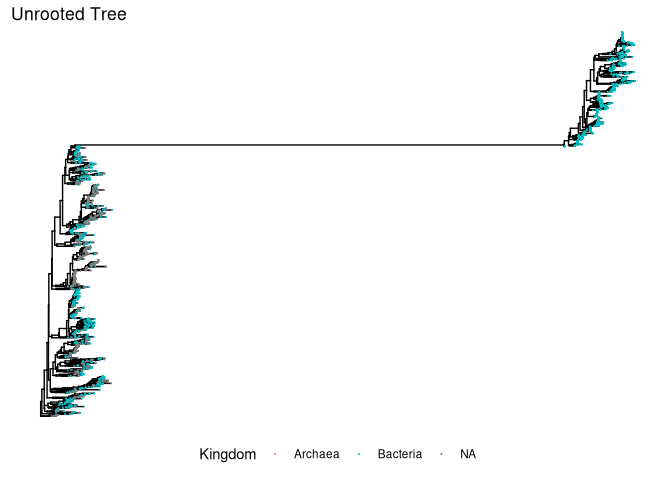
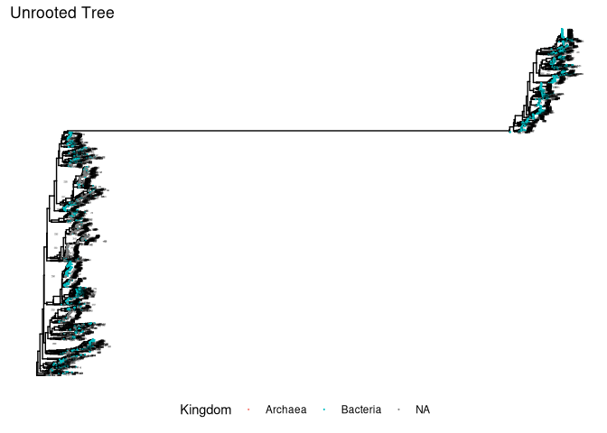
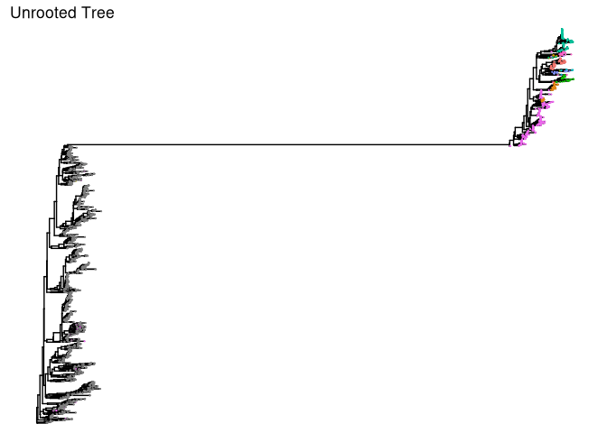
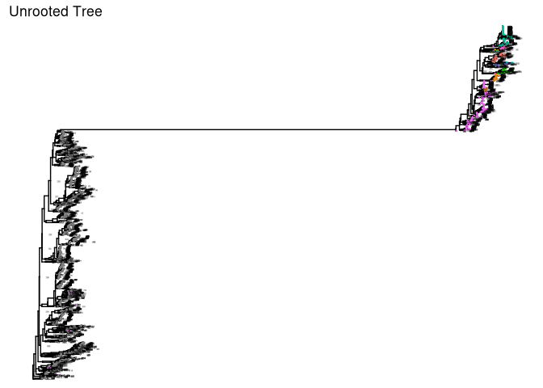
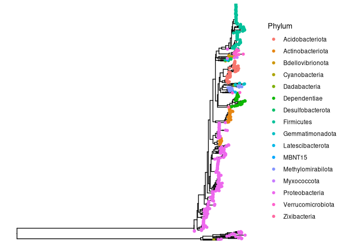

# Goals 

1. Load the fastree unrooted tree.  
2. Add tree to phyloseq object.  
3. Visualize and inspect tree with ggtree. 
4. Prune ASVs, if needed.  
5. Root our tree. 
6. Combine new tree with a phyloseq object. 
7. Save 2 phyloseq objects: 1. Unrooted tree phyloseq object, 2. Rooted tree phyloseq object. 

# Before you start

## Set my seed 

```r
# Any number can be chosen 
set.seed(238428)
```

## Load Packages 

```r
pacman::p_load(tidyverse, phyloseq, ggtree, phytools,
               install = FALSE)
```

## Load Data files 

```r
# Preprocessed phyloseq object 
load("data/02_PreProcessing/raw_preprocessed_physeq.RData")
raw_preprocessed_physeq
```

```
## phyloseq-class experiment-level object
## otu_table()   OTU Table:         [ 2138 taxa and 10 samples ]
## sample_data() Sample Data:       [ 10 samples by 10 sample variables ]
## tax_table()   Taxonomy Table:    [ 2138 taxa by 9 taxonomic ranks ]
```

```r
# Load in the tree! 
unrooted_tree <- read.tree("data/03_Phylogenetic_Tree/ASVs_unrooted.tree")
unrooted_tree
```

```
## 
## Phylogenetic tree with 2138 tips and 2136 internal nodes.
## 
## Tip labels:
##   ASV_1460, ASV_1202, ASV_1399, ASV_1479, ASV_1445, ASV_641, ...
## Node labels:
##   , 1.000, 0.983, 0.103, 0.978, 0.468, ...
## 
## Unrooted; includes branch lengths.
```

```r
str(unrooted_tree)
```

```
## List of 5
##  $ edge       : int [1:4273, 1:2] 2139 2140 2140 2141 2142 2143 2143 2142 2144 2145 ...
##  $ edge.length: num [1:4273] 0.10412 0.0464 0.06059 0.00598 0.01848 ...
##  $ Nnode      : int 2136
##  $ node.label : chr [1:2136] "" "1.000" "0.983" "0.103" ...
##  $ tip.label  : chr [1:2138] "ASV_1460" "ASV_1202" "ASV_1399" "ASV_1479" ...
##  - attr(*, "class")= chr "phylo"
##  - attr(*, "order")= chr "cladewise"
```


# Merge Phyloseq 

```r
# Intuition check 
stopifnot(ntaxa(raw_preprocessed_physeq) == ntaxa(unrooted_tree))

# Merge the tree with the phyloseq object 
unrooted_physeq <- 
  merge_phyloseq(raw_preprocessed_physeq, unrooted_tree)
```

```
## Found more than one class "phylo" in cache; using the first, from namespace 'phyloseq'
```

```
## Also defined by 'tidytree'
```

```
## Found more than one class "phylo" in cache; using the first, from namespace 'phyloseq'
```

```
## Also defined by 'tidytree'
```

```
## Found more than one class "phylo" in cache; using the first, from namespace 'phyloseq'
```

```
## Also defined by 'tidytree'
```

```
## Found more than one class "phylo" in cache; using the first, from namespace 'phyloseq'
```

```
## Also defined by 'tidytree'
```

```
## Found more than one class "phylo" in cache; using the first, from namespace 'phyloseq'
```

```
## Also defined by 'tidytree'
```

```
## Found more than one class "phylo" in cache; using the first, from namespace 'phyloseq'
```

```
## Also defined by 'tidytree'
```

```
## Found more than one class "phylo" in cache; using the first, from namespace 'phyloseq'
```

```
## Also defined by 'tidytree'
```

```r
unrooted_physeq
```

```
## phyloseq-class experiment-level object
## otu_table()   OTU Table:         [ 2138 taxa and 10 samples ]
## sample_data() Sample Data:       [ 10 samples by 10 sample variables ]
## tax_table()   Taxonomy Table:    [ 2138 taxa by 9 taxonomic ranks ]
## phy_tree()    Phylogenetic Tree: [ 2138 tips and 2136 internal nodes ]
```

# Plot Tree with `ggtree`

```r
# Make a basic tree
kingdom_tree <- 
  ggtree(unrooted_physeq) + 
  # color tips by kingdom 
  geom_tippoint(size = 0.1, mapping = aes(color = Kingdom)) +
  # Add title 
  labs(title = "Unrooted Tree") + 
  #move the legend to the bottom 
  theme(legend.position = "bottom"); kingdom_tree
```

<!-- -->

```r
kingdom_node_tree <- 
  kingdom_tree + 
  # Add the node label 
  geom_text(aes(label=node), hjust= -2, vjust = 1, size = 0.5)
kingdom_node_tree
```

<!-- -->

```r
phylum_tree <- 
  ggtree(unrooted_physeq) + 
  # color tips by phylum 
  geom_tippoint(size = 0.1, mapping = aes(color = Phylum)) +
  # Add title 
  labs(title = "Unrooted Tree") + 
  #move the legend to the bottom 
  theme(legend.position = "none"); phylum_tree
```

<!-- -->

```r
phylum_node_tree <- 
  phylum_tree + 
  # Add the node label 
  geom_text(aes(label=node), hjust= -2, vjust = 1, size = 0.5)
phylum_node_tree
```

<!-- -->
# Evaluate the crazy tree 
This part gets a bit manual
We will be pruning ASVs whose phylum is NA

```r
# Function from Joey McMurdie: https://github.com/joey711/phyloseq/issues/652
pop_taxa = function(physeq, badTaxa){
  allTaxa <-  taxa_names(physeq)
  allTaxa <- allTaxa[!(allTaxa %in% badTaxa)]
  return(prune_taxa(allTaxa, physeq))}

# get rid of NA phylum
no_asvs<-
  unrooted_physeq %>% 
  tax_table() %>% 
  data.frame() %>% 
  dplyr::filter(is.na(Phylum)) %>% 
  pull(ASV)

no_asvs
```

```
##    [1] "ASV_1460" "ASV_1202" "ASV_1399" "ASV_1479" "ASV_1445" "ASV_641" 
##    [7] "ASV_413"  "ASV_1025" "ASV_754"  "ASV_1254" "ASV_1698" "ASV_1890"
##   [13] "ASV_1593" "ASV_1645" "ASV_2025" "ASV_941"  "ASV_565"  "ASV_1044"
##   [19] "ASV_2023" "ASV_1862" "ASV_464"  "ASV_690"  "ASV_542"  "ASV_1168"
##   [25] "ASV_1048" "ASV_1003" "ASV_1397" "ASV_548"  "ASV_808"  "ASV_1162"
##   [31] "ASV_265"  "ASV_342"  "ASV_713"  "ASV_608"  "ASV_1270" "ASV_1968"
##   [37] "ASV_663"  "ASV_1171" "ASV_932"  "ASV_1579" "ASV_1708" "ASV_1536"
##   [43] "ASV_1634" "ASV_2006" "ASV_1803" "ASV_2019" "ASV_1439" "ASV_1789"
##   [49] "ASV_1948" "ASV_756"  "ASV_1695" "ASV_1823" "ASV_1934" "ASV_976" 
##   [55] "ASV_909"  "ASV_766"  "ASV_1369" "ASV_1984" "ASV_1922" "ASV_1859"
##   [61] "ASV_1308" "ASV_839"  "ASV_1164" "ASV_1700" "ASV_1305" "ASV_1442"
##   [67] "ASV_1006" "ASV_1426" "ASV_1443" "ASV_513"  "ASV_1702" "ASV_1571"
##   [73] "ASV_1887" "ASV_1744" "ASV_2013" "ASV_2001" "ASV_1205" "ASV_1651"
##   [79] "ASV_531"  "ASV_1000" "ASV_695"  "ASV_1198" "ASV_1971" "ASV_1703"
##   [85] "ASV_1273" "ASV_763"  "ASV_500"  "ASV_925"  "ASV_403"  "ASV_722" 
##   [91] "ASV_654"  "ASV_1742" "ASV_1026" "ASV_439"  "ASV_1021" "ASV_1268"
##   [97] "ASV_1412" "ASV_1060" "ASV_1315" "ASV_951"  "ASV_894"  "ASV_721" 
##  [103] "ASV_628"  "ASV_871"  "ASV_1715" "ASV_895"  "ASV_341"  "ASV_279" 
##  [109] "ASV_378"  "ASV_222"  "ASV_967"  "ASV_1366" "ASV_274"  "ASV_1738"
##  [115] "ASV_2031" "ASV_1998" "ASV_1999" "ASV_2113" "ASV_2115" "ASV_2109"
##  [121] "ASV_2015" "ASV_1977" "ASV_1271" "ASV_1370" "ASV_110"  "ASV_1469"
##  [127] "ASV_1970" "ASV_2049" "ASV_214"  "ASV_329"  "ASV_535"  "ASV_148" 
##  [133] "ASV_666"  "ASV_1749" "ASV_1831" "ASV_1966" "ASV_1689" "ASV_1886"
##  [139] "ASV_729"  "ASV_437"  "ASV_600"  "ASV_1073" "ASV_938"  "ASV_1394"
##  [145] "ASV_2114" "ASV_502"  "ASV_758"  "ASV_841"  "ASV_1512" "ASV_1534"
##  [151] "ASV_123"  "ASV_165"  "ASV_2074" "ASV_1982" "ASV_2112" "ASV_956" 
##  [157] "ASV_1551" "ASV_978"  "ASV_359"  "ASV_444"  "ASV_882"  "ASV_768" 
##  [163] "ASV_667"  "ASV_312"  "ASV_2047" "ASV_436"  "ASV_446"  "ASV_252" 
##  [169] "ASV_47"   "ASV_1309" "ASV_480"  "ASV_570"  "ASV_1004" "ASV_1542"
##  [175] "ASV_2037" "ASV_1836" "ASV_637"  "ASV_246"  "ASV_316"  "ASV_227" 
##  [181] "ASV_1038" "ASV_1480" "ASV_1821" "ASV_1107" "ASV_1104" "ASV_202" 
##  [187] "ASV_377"  "ASV_953"  "ASV_723"  "ASV_380"  "ASV_739"  "ASV_61"  
##  [193] "ASV_1858" "ASV_578"  "ASV_497"  "ASV_631"  "ASV_900"  "ASV_1729"
##  [199] "ASV_221"  "ASV_546"  "ASV_984"  "ASV_1002" "ASV_904"  "ASV_173" 
##  [205] "ASV_913"  "ASV_1229" "ASV_687"  "ASV_1149" "ASV_795"  "ASV_1288"
##  [211] "ASV_1106" "ASV_1390" "ASV_2082" "ASV_193"  "ASV_1630" "ASV_1575"
##  [217] "ASV_1688" "ASV_1403" "ASV_1544" "ASV_124"  "ASV_1438" "ASV_1861"
##  [223] "ASV_669"  "ASV_1342" "ASV_1200" "ASV_1424" "ASV_630"  "ASV_213" 
##  [229] "ASV_405"  "ASV_662"  "ASV_1251" "ASV_547"  "ASV_360"  "ASV_596" 
##  [235] "ASV_1866" "ASV_114"  "ASV_72"   "ASV_451"  "ASV_1163" "ASV_1402"
##  [241] "ASV_595"  "ASV_208"  "ASV_209"  "ASV_262"  "ASV_1197" "ASV_997" 
##  [247] "ASV_1101" "ASV_643"  "ASV_709"  "ASV_911"  "ASV_1213" "ASV_122" 
##  [253] "ASV_1253" "ASV_1440" "ASV_106"  "ASV_1298" "ASV_863"  "ASV_762" 
##  [259] "ASV_203"  "ASV_449"  "ASV_66"   "ASV_1337" "ASV_648"  "ASV_1989"
##  [265] "ASV_764"  "ASV_1736" "ASV_372"  "ASV_820"  "ASV_494"  "ASV_579" 
##  [271] "ASV_272"  "ASV_772"  "ASV_1972" "ASV_2014" "ASV_1940" "ASV_2021"
##  [277] "ASV_2018" "ASV_2029" "ASV_1941" "ASV_1975" "ASV_1983" "ASV_1986"
##  [283] "ASV_477"  "ASV_1790" "ASV_1673" "ASV_1718" "ASV_1720" "ASV_1501"
##  [289] "ASV_1606" "ASV_1670" "ASV_1772" "ASV_1672" "ASV_554"  "ASV_1247"
##  [295] "ASV_466"  "ASV_385"  "ASV_386"  "ASV_128"  "ASV_85"   "ASV_92"  
##  [301] "ASV_116"  "ASV_1981" "ASV_78"   "ASV_170"  "ASV_109"  "ASV_770" 
##  [307] "ASV_1997" "ASV_419"  "ASV_207"  "ASV_250"  "ASV_100"  "ASV_50"  
##  [313] "ASV_113"  "ASV_84"   "ASV_515"  "ASV_93"   "ASV_139"  "ASV_1877"
##  [319] "ASV_1935" "ASV_2008" "ASV_2009" "ASV_105"  "ASV_711"  "ASV_791" 
##  [325] "ASV_275"  "ASV_180"  "ASV_238"  "ASV_134"  "ASV_71"   "ASV_2016"
##  [331] "ASV_1965" "ASV_2043" "ASV_1520" "ASV_1294" "ASV_1653" "ASV_1105"
##  [337] "ASV_1115" "ASV_2034" "ASV_1252" "ASV_880"  "ASV_1009" "ASV_1429"
##  [343] "ASV_1759" "ASV_1489" "ASV_1797" "ASV_1087" "ASV_927"  "ASV_301" 
##  [349] "ASV_922"  "ASV_331"  "ASV_1196" "ASV_1583" "ASV_974"  "ASV_708" 
##  [355] "ASV_943"  "ASV_627"  "ASV_699"  "ASV_1391" "ASV_1950" "ASV_2121"
##  [361] "ASV_2122" "ASV_942"  "ASV_1339" "ASV_1113" "ASV_1001" "ASV_1623"
##  [367] "ASV_939"  "ASV_971"  "ASV_610"  "ASV_352"  "ASV_587"  "ASV_780" 
##  [373] "ASV_526"  "ASV_804"  "ASV_1363" "ASV_1227" "ASV_1362" "ASV_1457"
##  [379] "ASV_1937" "ASV_465"  "ASV_618"  "ASV_712"  "ASV_1737" "ASV_498" 
##  [385] "ASV_1731" "ASV_1709" "ASV_2072" "ASV_1574" "ASV_1297" "ASV_590" 
##  [391] "ASV_740"  "ASV_1755" "ASV_452"  "ASV_339"  "ASV_489"  "ASV_527" 
##  [397] "ASV_367"  "ASV_859"  "ASV_1027" "ASV_1040" "ASV_1150" "ASV_276" 
##  [403] "ASV_382"  "ASV_798"  "ASV_683"  "ASV_387"  "ASV_422"  "ASV_423" 
##  [409] "ASV_607"  "ASV_594"  "ASV_793"  "ASV_1165" "ASV_1343" "ASV_1530"
##  [415] "ASV_1525" "ASV_64"   "ASV_937"  "ASV_1919" "ASV_1400" "ASV_2030"
##  [421] "ASV_1931" "ASV_968"  "ASV_420"  "ASV_735"  "ASV_1945" "ASV_533" 
##  [427] "ASV_856"  "ASV_459"  "ASV_1691" "ASV_371"  "ASV_2011" "ASV_373" 
##  [433] "ASV_118"  "ASV_632"  "ASV_1183" "ASV_636"  "ASV_883"  "ASV_1293"
##  [439] "ASV_326"  "ASV_408"  "ASV_487"  "ASV_136"  "ASV_337"  "ASV_620" 
##  [445] "ASV_755"  "ASV_747"  "ASV_886"  "ASV_1241" "ASV_2035" "ASV_1822"
##  [451] "ASV_1884" "ASV_1432" "ASV_1876" "ASV_1619" "ASV_168"  "ASV_625" 
##  [457] "ASV_1368" "ASV_910"  "ASV_979"  "ASV_1070" "ASV_1367" "ASV_827" 
##  [463] "ASV_255"  "ASV_320"  "ASV_688"  "ASV_334"  "ASV_454"  "ASV_784" 
##  [469] "ASV_236"  "ASV_196"  "ASV_873"  "ASV_957"  "ASV_924"  "ASV_782" 
##  [475] "ASV_988"  "ASV_1024" "ASV_1134" "ASV_1181" "ASV_70"   "ASV_783" 
##  [481] "ASV_1230" "ASV_582"  "ASV_1633" "ASV_609"  "ASV_2000" "ASV_2038"
##  [487] "ASV_1705" "ASV_1871" "ASV_1383" "ASV_1249" "ASV_1704" "ASV_1300"
##  [493] "ASV_1482" "ASV_1820" "ASV_1873" "ASV_69"   "ASV_1075" "ASV_1157"
##  [499] "ASV_2024" "ASV_2084" "ASV_792"  "ASV_441"  "ASV_1248" "ASV_315" 
##  [505] "ASV_26"   "ASV_194"  "ASV_254"  "ASV_560"  "ASV_1231" "ASV_990" 
##  [511] "ASV_588"  "ASV_991"  "ASV_761"  "ASV_1671" "ASV_79"   "ASV_129" 
##  [517] "ASV_1809" "ASV_1641" "ASV_1719" "ASV_1799" "ASV_1203" "ASV_1537"
##  [523] "ASV_1449" "ASV_1590" "ASV_269"  "ASV_292"  "ASV_1527" "ASV_1573"
##  [529] "ASV_1350" "ASV_1818" "ASV_190"  "ASV_966"  "ASV_1523" "ASV_1539"
##  [535] "ASV_1748" "ASV_959"  "ASV_1754" "ASV_1307" "ASV_473"  "ASV_1076"
##  [541] "ASV_485"  "ASV_1639" "ASV_1647" "ASV_484"  "ASV_1167" "ASV_840" 
##  [547] "ASV_844"  "ASV_1221" "ASV_1153" "ASV_1218" "ASV_57"   "ASV_491" 
##  [553] "ASV_1511" "ASV_2107" "ASV_335"  "ASV_516"  "ASV_555"  "ASV_319" 
##  [559] "ASV_1232" "ASV_212"  "ASV_693"  "ASV_1826" "ASV_1529" "ASV_1787"
##  [565] "ASV_850"  "ASV_1535" "ASV_1825" "ASV_1864" "ASV_1874" "ASV_1338"
##  [571] "ASV_1195" "ASV_1405" "ASV_613"  "ASV_1385" "ASV_719"  "ASV_1393"
##  [577] "ASV_1152" "ASV_1745" "ASV_453"  "ASV_1415" "ASV_2077" "ASV_2096"
##  [583] "ASV_2088" "ASV_493"  "ASV_1644" "ASV_1468" "ASV_1471" "ASV_1470"
##  [589] "ASV_1649" "ASV_1199" "ASV_1389" "ASV_1292" "ASV_234"  "ASV_1334"
##  [595] "ASV_1636" "ASV_1396" "ASV_1699" "ASV_1687" "ASV_1287" "ASV_2040"
##  [601] "ASV_897"  "ASV_1640" "ASV_1588" "ASV_1045" "ASV_569"  "ASV_443" 
##  [607] "ASV_694"  "ASV_773"  "ASV_83"   "ASV_348"  "ASV_1584" "ASV_817" 
##  [613] "ASV_822"  "ASV_2042" "ASV_133"  "ASV_183"  "ASV_143"  "ASV_831" 
##  [619] "ASV_807"  "ASV_1085" "ASV_379"  "ASV_305"  "ASV_1486" "ASV_1642"
##  [625] "ASV_296"  "ASV_448"  "ASV_1760" "ASV_769"  "ASV_2091" "ASV_2101"
##  [631] "ASV_2090" "ASV_2093" "ASV_2094" "ASV_2017" "ASV_332"  "ASV_893" 
##  [637] "ASV_923"  "ASV_1607" "ASV_1951" "ASV_1848" "ASV_166"  "ASV_567" 
##  [643] "ASV_295"  "ASV_161"  "ASV_1207" "ASV_1381" "ASV_1734" "ASV_1629"
##  [649] "ASV_668"  "ASV_1160" "ASV_1116" "ASV_55"   "ASV_707"  "ASV_551" 
##  [655] "ASV_530"  "ASV_482"  "ASV_553"  "ASV_476"  "ASV_819"  "ASV_1654"
##  [661] "ASV_182"  "ASV_752"  "ASV_566"  "ASV_1379" "ASV_790"  "ASV_232" 
##  [667] "ASV_584"  "ASV_680"  "ASV_1829" "ASV_1865" "ASV_2003" "ASV_1932"
##  [673] "ASV_2079" "ASV_2050" "ASV_2102" "ASV_2104" "ASV_178"  "ASV_1585"
##  [679] "ASV_304"  "ASV_975"  "ASV_1118" "ASV_1751" "ASV_1133" "ASV_327" 
##  [685] "ASV_244"  "ASV_1921" "ASV_1868" "ASV_1918" "ASV_1978" "ASV_1916"
##  [691] "ASV_1976" "ASV_534"  "ASV_383"  "ASV_468"  "ASV_1365" "ASV_1274"
##  [697] "ASV_1417" "ASV_1610" "ASV_589"  "ASV_1674" "ASV_421"  "ASV_445" 
##  [703] "ASV_95"   "ASV_1901" "ASV_1902" "ASV_1900" "ASV_1903" "ASV_1608"
##  [709] "ASV_1553" "ASV_1717" "ASV_1444" "ASV_1807" "ASV_1879" "ASV_1806"
##  [715] "ASV_1810" "ASV_1811" "ASV_2012" "ASV_1942" "ASV_2004" "ASV_660" 
##  [721] "ASV_1906" "ASV_1955" "ASV_1475" "ASV_541"  "ASV_1791" "ASV_581" 
##  [727] "ASV_288"  "ASV_501"  "ASV_1289" "ASV_1578" "ASV_1335" "ASV_1587"
##  [733] "ASV_1524" "ASV_1622" "ASV_1638" "ASV_1750" "ASV_1500" "ASV_760" 
##  [739] "ASV_675"  "ASV_1059" "ASV_870"  "ASV_508"  "ASV_653"  "ASV_545" 
##  [745] "ASV_1057" "ASV_869"  "ASV_986"  "ASV_1550" "ASV_2057" "ASV_2056"
##  [751] "ASV_1954" "ASV_2055" "ASV_1256" "ASV_336"  "ASV_1758" "ASV_646" 
##  [757] "ASV_2108" "ASV_2100" "ASV_2116" "ASV_1518" "ASV_407"  "ASV_483" 
##  [763] "ASV_251"  "ASV_614"  "ASV_1771" "ASV_950"  "ASV_848"  "ASV_1130"
##  [769] "ASV_949"  "ASV_985"  "ASV_433"  "ASV_1576" "ASV_1631" "ASV_1627"
##  [775] "ASV_1515" "ASV_1484" "ASV_1474" "ASV_1757" "ASV_933"  "ASV_1349"
##  [781] "ASV_1228" "ASV_1459" "ASV_1414" "ASV_1756" "ASV_877"  "ASV_1577"
##  [787] "ASV_159"  "ASV_440"  "ASV_1058" "ASV_7"    "ASV_14"   "ASV_12"  
##  [793] "ASV_22"   "ASV_5"    "ASV_51"   "ASV_86"   "ASV_80"   "ASV_87"  
##  [799] "ASV_1"    "ASV_21"   "ASV_27"   "ASV_18"   "ASV_642"  "ASV_396" 
##  [805] "ASV_616"  "ASV_1259" "ASV_823"  "ASV_2080" "ASV_2083" "ASV_1706"
##  [811] "ASV_2036" "ASV_1846" "ASV_1992" "ASV_2052" "ASV_2105" "ASV_1102"
##  [817] "ASV_282"  "ASV_65"   "ASV_241"  "ASV_809"  "ASV_1867" "ASV_1917"
##  [823] "ASV_163"  "ASV_691"  "ASV_664"  "ASV_486"  "ASV_753"  "ASV_277" 
##  [829] "ASV_701"  "ASV_411"  "ASV_1473" "ASV_42"   "ASV_1416" "ASV_1132"
##  [835] "ASV_1244" "ASV_1348" "ASV_1411" "ASV_559"  "ASV_806"  "ASV_787" 
##  [841] "ASV_805"  "ASV_325"  "ASV_404"  "ASV_629"  "ASV_40"   "ASV_430" 
##  [847] "ASV_1217" "ASV_247"  "ASV_748"  "ASV_562"  "ASV_1007" "ASV_1109"
##  [853] "ASV_455"  "ASV_289"  "ASV_597"  "ASV_1387" "ASV_425"  "ASV_781" 
##  [859] "ASV_188"  "ASV_390"  "ASV_1904" "ASV_1828" "ASV_785"  "ASV_101" 
##  [865] "ASV_2027" "ASV_140"  "ASV_226"  "ASV_732"  "ASV_786"  "ASV_88"  
##  [871] "ASV_189"  "ASV_655"  "ASV_682"  "ASV_999"  "ASV_2010" "ASV_689" 
##  [877] "ASV_640"  "ASV_1112" "ASV_1805" "ASV_2092" "ASV_818"  "ASV_1206"
##  [883] "ASV_1543" "ASV_1128" "ASV_892"  "ASV_987"  "ASV_921"  "ASV_952" 
##  [889] "ASV_677"  "ASV_1194" "ASV_1216" "ASV_2103" "ASV_1747" "ASV_1869"
##  [895] "ASV_1692" "ASV_1814" "ASV_1696" "ASV_1303" "ASV_1572" "ASV_1939"
##  [901] "ASV_518"  "ASV_638"  "ASV_1707" "ASV_1299" "ASV_561"  "ASV_1138"
##  [907] "ASV_1927" "ASV_1995" "ASV_2041" "ASV_1993" "ASV_2097" "ASV_1974"
##  [913] "ASV_89"   "ASV_977"  "ASV_1336" "ASV_1285" "ASV_52"   "ASV_2053"
##  [919] "ASV_1953" "ASV_2054" "ASV_103"  "ASV_131"  "ASV_102"  "ASV_125" 
##  [925] "ASV_2081" "ASV_54"   "ASV_175"  "ASV_179"  "ASV_245"  "ASV_797" 
##  [931] "ASV_583"  "ASV_2118" "ASV_2120" "ASV_728"  "ASV_184"  "ASV_303" 
##  [937] "ASV_509"  "ASV_323"  "ASV_574"  "ASV_428"  "ASV_857"  "ASV_1341"
##  [943] "ASV_63"   "ASV_242"  "ASV_302"  "ASV_94"   "ASV_115"  "ASV_97"  
##  [949] "ASV_353"  "ASV_510"  "ASV_1437" "ASV_519"  "ASV_706"  "ASV_469" 
##  [955] "ASV_370"  "ASV_936"  "ASV_1812" "ASV_75"   "ASV_145"  "ASV_1792"
##  [961] "ASV_2044" "ASV_1384" "ASV_417"  "ASV_470"  "ASV_684"  "ASV_126" 
##  [967] "ASV_187"  "ASV_645"  "ASV_2099" "ASV_49"   "ASV_972"  "ASV_1155"
##  [973] "ASV_661"  "ASV_434"  "ASV_505"  "ASV_492"  "ASV_356"  "ASV_621" 
##  [979] "ASV_1215" "ASV_718"  "ASV_750"  "ASV_504"  "ASV_934"  "ASV_996" 
##  [985] "ASV_1310" "ASV_1586" "ASV_1061" "ASV_1433" "ASV_1435" "ASV_432" 
##  [991] "ASV_751"  "ASV_796"  "ASV_225"  "ASV_731"  "ASV_998"  "ASV_1008"
##  [997] "ASV_1071" "ASV_1483" "ASV_1046" "ASV_435"  "ASV_146"  "ASV_1980"
## [1003] "ASV_543"  "ASV_1476" "ASV_397"  "ASV_685"  "ASV_714"  "ASV_59"  
## [1009] "ASV_639"  "ASV_1832" "ASV_1514" "ASV_478"  "ASV_463"  "ASV_734" 
## [1015] "ASV_150"  "ASV_2048" "ASV_237"  "ASV_107"  "ASV_157"  "ASV_167" 
## [1021] "ASV_171"  "ASV_206"  "ASV_503"  "ASV_467"  "ASV_710"  "ASV_599" 
## [1027] "ASV_603"  "ASV_771"  "ASV_876"  "ASV_619"  "ASV_1041" "ASV_767" 
## [1033] "ASV_1924" "ASV_1990" "ASV_1985" "ASV_1928" "ASV_1925" "ASV_1926"
## [1039] "ASV_647"  "ASV_686"  "ASV_1929" "ASV_1967" "ASV_1969" "ASV_181" 
## [1045] "ASV_154"  "ASV_132"  "ASV_195"  "ASV_270"  "ASV_298"  "ASV_120" 
## [1051] "ASV_258"  "ASV_1100" "ASV_716"  "ASV_1286" "ASV_1947" "ASV_2033"
## [1057] "ASV_62"   "ASV_349"  "ASV_90"   "ASV_142"  "ASV_1732" "ASV_358" 
## [1063] "ASV_431"  "ASV_384"  "ASV_552"  "ASV_1302" "ASV_601"  "ASV_1533"
## [1069] "ASV_1943" "ASV_1994" "ASV_2039" "ASV_1635" "ASV_1472" "ASV_1345"
## [1075] "ASV_1208" "ASV_1448" "ASV_605"  "ASV_887"  "ASV_98"   "ASV_575" 
## [1081] "ASV_1870" "ASV_151"  "ASV_681"  "ASV_815"  "ASV_1220" "ASV_1344"
## [1087] "ASV_1798" "ASV_1891" "ASV_1885" "ASV_1816" "ASV_1519" "ASV_1589"
## [1093] "ASV_1580" "ASV_858"  "ASV_1114" "ASV_273"  "ASV_393"  "ASV_633" 
## [1099] "ASV_1447" "ASV_2045" "ASV_1005" "ASV_1043" "ASV_56"   "ASV_235" 
## [1105] "ASV_749"  "ASV_1222" "ASV_1979" "ASV_1481" "ASV_111"  "ASV_2078"
## [1111] "ASV_842"  "ASV_1108" "ASV_1340" "ASV_1863" "ASV_365"  "ASV_1880"
## [1117] "ASV_1156" "ASV_1491" "ASV_2117" "ASV_717"  "ASV_1099" "ASV_1209"
## [1123] "ASV_1889" "ASV_1072" "ASV_1774" "ASV_1137" "ASV_2051" "ASV_931" 
## [1129] "ASV_1404" "ASV_1380" "ASV_1478" "ASV_571"  "ASV_198"  "ASV_845" 
## [1135] "ASV_1351" "ASV_1111" "ASV_1944" "ASV_1835" "ASV_137"  "ASV_861" 
## [1141] "ASV_1245" "ASV_130"  "ASV_91"   "ASV_514"  "ASV_862"  "ASV_733" 
## [1147] "ASV_824"  "ASV_1258" "ASV_429"  "ASV_775"  "ASV_884"  "ASV_1378"
## [1153] "ASV_185"  "ASV_2046" "ASV_2089" "ASV_2073" "ASV_2110" "ASV_60"  
## [1159] "ASV_104"  "ASV_821"  "ASV_540"  "ASV_615"  "ASV_2005" "ASV_1987"
## [1165] "ASV_2007" "ASV_1211" "ASV_1570" "ASV_1694" "ASV_2076" "ASV_730" 
## [1171] "ASV_1290" "ASV_757"  "ASV_1595" "ASV_1158" "ASV_970"  "ASV_1219"
## [1177] "ASV_1406" "ASV_1773" "ASV_46"   "ASV_224"  "ASV_2028" "ASV_364" 
## [1183] "ASV_765"  "ASV_1882" "ASV_656"  "ASV_954"  "ASV_2032" "ASV_263" 
## [1189] "ASV_363"  "ASV_418"  "ASV_1628" "ASV_1946" "ASV_1541" "ASV_1243"
## [1195] "ASV_602"  "ASV_826"  "ASV_814"  "ASV_1296" "ASV_705"  "ASV_568" 
## [1201] "ASV_617"  "ASV_715"  "ASV_825"  "ASV_1488" "ASV_1242" "ASV_1304"
## [1207] "ASV_1988" "ASV_144"  "ASV_389"  "ASV_511"  "ASV_1077" "ASV_1306"
## [1213] "ASV_412"  "ASV_340"  "ASV_474"  "ASV_1794" "ASV_1804" "ASV_958" 
## [1219] "ASV_1793" "ASV_816"  "ASV_1714" "ASV_73"   "ASV_317"  "ASV_1492"
## [1225] "ASV_1154" "ASV_424"  "ASV_851"  "ASV_1250" "ASV_81"   "ASV_490" 
## [1231] "ASV_67"   "ASV_860"  "ASV_843"  "ASV_908"  "ASV_1996" "ASV_1701"
## [1237] "ASV_1690" "ASV_1817" "ASV_1201" "ASV_1646" "ASV_1388" "ASV_1594"
## [1243] "ASV_1652" "ASV_141"  "ASV_395"  "ASV_1686" "ASV_1291" "ASV_1730"
## [1249] "ASV_1621" "ASV_1813" "ASV_973"  "ASV_1538" "ASV_1477" "ASV_1333"
## [1255] "ASV_1151" "ASV_644"  "ASV_692"  "ASV_2106" "ASV_1395" "ASV_343" 
## [1261] "ASV_563"  "ASV_935"  "ASV_374"  "ASV_205"  "ASV_738"  "ASV_1648"
## [1267] "ASV_1991" "ASV_219"  "ASV_388"  "ASV_306"  "ASV_665"  "ASV_1246"
## [1273] "ASV_1347" "ASV_1392" "ASV_1795" "ASV_1591" "ASV_1517" "ASV_1582"
## [1279] "ASV_890"  "ASV_1139" "ASV_1210" "ASV_1260" "ASV_1386" "ASV_1592"
## [1285] "ASV_960"  "ASV_1042" "ASV_907"  "ASV_1117" "ASV_1933" "ASV_1502"
## [1291] "ASV_572"  "ASV_512"  "ASV_881"  "ASV_678"  "ASV_1875" "ASV_1920"
## [1297] "ASV_1938" "ASV_1632" "ASV_1881" "ASV_2002" "ASV_1740" "ASV_1743"
## [1303] "ASV_1973" "ASV_1801" "ASV_906"  "ASV_1346" "ASV_1516" "ASV_1808"
## [1309] "ASV_1295" "ASV_1531" "ASV_1301" "ASV_1800" "ASV_1656" "ASV_314" 
## [1315] "ASV_564"  "ASV_774"  "ASV_1827" "ASV_1401" "ASV_912"  "ASV_1581"
## [1321] "ASV_1521" "ASV_1214" "ASV_1490" "ASV_1540" "ASV_1485" "ASV_1741"
## [1327] "ASV_1834" "ASV_1532" "ASV_1624" "ASV_1833" "ASV_1872" "ASV_573" 
## [1333] "ASV_2098" "ASV_1883" "ASV_1824" "ASV_361"  "ASV_1255" "ASV_794" 
## [1339] "ASV_1775" "ASV_874"  "ASV_1434" "ASV_260"  "ASV_1552" "ASV_211" 
## [1345] "ASV_271"  "ASV_1923" "ASV_1830" "ASV_1170" "ASV_311"  "ASV_1039"
## [1351] "ASV_940"  "ASV_450"  "ASV_1847" "ASV_344"  "ASV_2026" "ASV_598" 
## [1357] "ASV_338"  "ASV_284"  "ASV_832"  "ASV_481"  "ASV_48"   "ASV_333" 
## [1363] "ASV_406"  "ASV_164"  "ASV_108"  "ASV_223"  "ASV_591"  "ASV_1275"
## [1369] "ASV_872"  "ASV_76"   "ASV_700"  "ASV_1131" "ASV_1503" "ASV_905" 
## [1375] "ASV_351"  "ASV_1650" "ASV_1159" "ASV_1458" "ASV_849"  "ASV_1135"
## [1381] "ASV_1407" "ASV_1431" "ASV_1815" "ASV_2020" "ASV_1382" "ASV_1528"
## [1387] "ASV_1269" "ASV_1226" "ASV_1316" "ASV_1083" "ASV_1267" "ASV_674" 
## [1393] "ASV_1905" "ASV_1878" "ASV_1716" "ASV_1430" "ASV_309"  "ASV_1697"
## [1399] "ASV_2075" "ASV_458"  "ASV_1425" "ASV_1074" "ASV_1655" "ASV_155" 
## [1405] "ASV_604"  "ASV_1428" "ASV_366"  "ASV_1204" "ASV_53"   "ASV_1182"
## [1411] "ASV_447"  "ASV_776"  "ASV_99"   "ASV_475"  "ASV_676"  "ASV_926" 
## [1417] "ASV_158"  "ASV_1513" "ASV_1625" "ASV_297"  "ASV_2086" "ASV_2087"
## [1423] "ASV_2095" "ASV_1837" "ASV_1427" "ASV_1487" "ASV_1643" "ASV_878" 
## [1429] "ASV_1257" "ASV_2085" "ASV_1418" "ASV_58"   "ASV_243"  "ASV_1047"
## [1435] "ASV_1605" "ASV_1364" "ASV_891"  "ASV_1022" "ASV_896"  "ASV_1023"
## [1441] "ASV_1129" "ASV_138"  "ASV_160"  "ASV_77"   "ASV_283"  "ASV_313" 
## [1447] "ASV_520"  "ASV_989"  "ASV_1136" "ASV_1272" "ASV_1084" "ASV_1317"
## [1453] "ASV_1668" "ASV_1669" "ASV_879"  "ASV_955"  "ASV_1166" "ASV_899" 
## [1459] "ASV_1212" "ASV_1735" "ASV_885"  "ASV_1103" "ASV_1609" "ASV_1796"
## [1465] "ASV_1526" "ASV_2119" "ASV_1733" "ASV_1819" "ASV_1626" "ASV_1746"
## [1471] "ASV_1888" "ASV_1318" "ASV_357"  "ASV_1086" "ASV_1693" "ASV_1802"
## [1477] "ASV_1398" "ASV_1522"
```

```r
# Function from Joey McMurdie: https://github.com/joey711/phyloseq/issues/652
pop_taxa = function(physeq, badTaxa){
  allTaxa <-  taxa_names(physeq)
  allTaxa <- allTaxa[!(allTaxa %in% badTaxa)]
  return(prune_taxa(allTaxa, physeq))}

# Let's use the pop_taxa function :) 
# Recreate a phyloseq object without ASV_456
unrooted_physeq_rmNA <- 
  unrooted_physeq %>%
  pop_taxa(., no_asvs)
```

```
## Found more than one class "phylo" in cache; using the first, from namespace 'phyloseq'
```

```
## Also defined by 'tidytree'
```

```r
#intiution check
ntaxa(unrooted_physeq) - ntaxa(unrooted_physeq_rmNA)
```

```
## [1] 1478
```


# Midroot Tree

```r
# Is the tree rooted?
new_unrooted_tree <-phy_tree(unrooted_physeq_rmNA)
is.rooted(new_unrooted_tree)
```

```
## [1] TRUE
```

```r
# Let's midpoint root the tree
midpoint_rooted_tree <- midpoint.root(new_unrooted_tree)

# Is the new tree rooted?
is.rooted(midpoint_rooted_tree)
```

```
## [1] TRUE
```

```r
# Assign to a new phyloseq object: merging subsetted phyloseq with the new rooted tree

# Merge tree 
midroot_physeq <- 
  merge_phyloseq(raw_preprocessed_physeq, midpoint_rooted_tree)
```

```
## Found more than one class "phylo" in cache; using the first, from namespace 'phyloseq'
```

```
## Also defined by 'tidytree'
```

```
## Found more than one class "phylo" in cache; using the first, from namespace 'phyloseq'
```

```
## Also defined by 'tidytree'
```

```
## Found more than one class "phylo" in cache; using the first, from namespace 'phyloseq'
```

```
## Also defined by 'tidytree'
```

```
## Found more than one class "phylo" in cache; using the first, from namespace 'phyloseq'
```

```
## Also defined by 'tidytree'
```

```r
midroot_physeq
```

```
## phyloseq-class experiment-level object
## otu_table()   OTU Table:         [ 660 taxa and 10 samples ]
## sample_data() Sample Data:       [ 10 samples by 10 sample variables ]
## tax_table()   Taxonomy Table:    [ 660 taxa by 9 taxonomic ranks ]
## phy_tree()    Phylogenetic Tree: [ 660 tips and 659 internal nodes ]
```

```r
# Quick inspection of tree 
ggtree(midroot_physeq) + 
  geom_tippoint(mapping = aes(color = Phylum))
```

<!-- -->


# Save to a new phyloseq object

```r
# Save both phyloseq objects with our tree object to one .RData file 
save(list = c("unrooted_physeq", "midroot_physeq"),
     file = "data/03_Phylogenetic_Tree/phytree_preprocessed_physeq.RData")
```

# Session Information 

```r
# Ensure reproducibility 
devtools::session_info()
```

```
## ─ Session info ───────────────────────────────────────────────────────────────
##  setting  value
##  version  R version 4.3.2 (2023-10-31)
##  os       Rocky Linux 9.0 (Blue Onyx)
##  system   x86_64, linux-gnu
##  ui       X11
##  language (EN)
##  collate  en_US.UTF-8
##  ctype    en_US.UTF-8
##  tz       America/New_York
##  date     2024-04-29
##  pandoc   3.1.1 @ /usr/lib/rstudio-server/bin/quarto/bin/tools/ (via rmarkdown)
## 
## ─ Packages ───────────────────────────────────────────────────────────────────
##  package           * version    date (UTC) lib source
##  ade4                1.7-22     2023-02-06 [1] CRAN (R 4.3.2)
##  ape               * 5.7-1      2023-03-13 [2] CRAN (R 4.3.2)
##  aplot               0.2.2      2023-10-06 [1] CRAN (R 4.3.2)
##  Biobase             2.62.0     2023-10-24 [2] Bioconductor
##  BiocGenerics        0.48.1     2023-11-01 [2] Bioconductor
##  biomformat          1.30.0     2023-10-24 [1] Bioconductor
##  Biostrings          2.70.1     2023-10-25 [2] Bioconductor
##  bitops              1.0-7      2021-04-24 [2] CRAN (R 4.3.2)
##  bslib               0.5.1      2023-08-11 [2] CRAN (R 4.3.2)
##  cachem              1.0.8      2023-05-01 [2] CRAN (R 4.3.2)
##  callr               3.7.3      2022-11-02 [2] CRAN (R 4.3.2)
##  cli                 3.6.1      2023-03-23 [2] CRAN (R 4.3.2)
##  cluster             2.1.4      2022-08-22 [2] CRAN (R 4.3.2)
##  clusterGeneration   1.3.8      2023-08-16 [1] CRAN (R 4.3.2)
##  coda                0.19-4     2020-09-30 [2] CRAN (R 4.3.2)
##  codetools           0.2-19     2023-02-01 [2] CRAN (R 4.3.2)
##  colorspace          2.1-0      2023-01-23 [2] CRAN (R 4.3.2)
##  combinat            0.0-8      2012-10-29 [1] CRAN (R 4.3.2)
##  crayon              1.5.2      2022-09-29 [2] CRAN (R 4.3.2)
##  data.table          1.14.8     2023-02-17 [2] CRAN (R 4.3.2)
##  devtools            2.4.4      2022-07-20 [2] CRAN (R 4.2.1)
##  digest              0.6.33     2023-07-07 [2] CRAN (R 4.3.2)
##  doParallel          1.0.17     2022-02-07 [2] CRAN (R 4.3.2)
##  dplyr             * 1.1.3      2023-09-03 [2] CRAN (R 4.3.2)
##  ellipsis            0.3.2      2021-04-29 [2] CRAN (R 4.3.2)
##  evaluate            0.23       2023-11-01 [2] CRAN (R 4.3.2)
##  expm                0.999-9    2024-01-11 [1] CRAN (R 4.3.2)
##  fansi               1.0.5      2023-10-08 [2] CRAN (R 4.3.2)
##  farver              2.1.1      2022-07-06 [2] CRAN (R 4.3.2)
##  fastmap             1.1.1      2023-02-24 [2] CRAN (R 4.3.2)
##  fastmatch           1.1-4      2023-08-18 [1] CRAN (R 4.3.2)
##  forcats           * 1.0.0      2023-01-29 [1] CRAN (R 4.3.2)
##  foreach             1.5.2      2022-02-02 [2] CRAN (R 4.3.2)
##  fs                  1.6.3      2023-07-20 [2] CRAN (R 4.3.2)
##  generics            0.1.3      2022-07-05 [2] CRAN (R 4.3.2)
##  GenomeInfoDb        1.38.0     2023-10-24 [2] Bioconductor
##  GenomeInfoDbData    1.2.11     2023-11-07 [2] Bioconductor
##  ggfun               0.1.4      2024-01-19 [1] CRAN (R 4.3.2)
##  ggplot2           * 3.5.0      2024-02-23 [2] CRAN (R 4.3.2)
##  ggplotify           0.1.2      2023-08-09 [1] CRAN (R 4.3.2)
##  ggtree            * 3.10.1     2024-02-25 [1] Bioconductor 3.18 (R 4.3.2)
##  glue                1.6.2      2022-02-24 [2] CRAN (R 4.3.2)
##  gridGraphics        0.5-1      2020-12-13 [1] CRAN (R 4.3.2)
##  gtable              0.3.4      2023-08-21 [2] CRAN (R 4.3.2)
##  highr               0.10       2022-12-22 [2] CRAN (R 4.3.2)
##  hms                 1.1.3      2023-03-21 [1] CRAN (R 4.3.2)
##  htmltools           0.5.7      2023-11-03 [2] CRAN (R 4.3.2)
##  htmlwidgets         1.6.2      2023-03-17 [2] CRAN (R 4.3.2)
##  httpuv              1.6.12     2023-10-23 [2] CRAN (R 4.3.2)
##  igraph              1.5.1      2023-08-10 [2] CRAN (R 4.3.2)
##  IRanges             2.36.0     2023-10-24 [2] Bioconductor
##  iterators           1.0.14     2022-02-05 [2] CRAN (R 4.3.2)
##  jquerylib           0.1.4      2021-04-26 [2] CRAN (R 4.3.2)
##  jsonlite            1.8.7      2023-06-29 [2] CRAN (R 4.3.2)
##  knitr               1.45       2023-10-30 [2] CRAN (R 4.3.2)
##  labeling            0.4.3      2023-08-29 [2] CRAN (R 4.3.2)
##  later               1.3.1      2023-05-02 [2] CRAN (R 4.3.2)
##  lattice             0.21-9     2023-10-01 [2] CRAN (R 4.3.2)
##  lazyeval            0.2.2      2019-03-15 [2] CRAN (R 4.3.2)
##  lifecycle           1.0.3      2022-10-07 [2] CRAN (R 4.3.2)
##  lubridate         * 1.9.3      2023-09-27 [1] CRAN (R 4.3.2)
##  magrittr            2.0.3      2022-03-30 [2] CRAN (R 4.3.2)
##  maps              * 3.4.2      2023-12-15 [1] CRAN (R 4.3.2)
##  MASS                7.3-60     2023-05-04 [2] CRAN (R 4.3.2)
##  Matrix              1.6-1.1    2023-09-18 [2] CRAN (R 4.3.2)
##  memoise             2.0.1      2021-11-26 [2] CRAN (R 4.3.2)
##  mgcv                1.9-0      2023-07-11 [2] CRAN (R 4.3.2)
##  mime                0.12       2021-09-28 [2] CRAN (R 4.3.2)
##  miniUI              0.1.1.1    2018-05-18 [2] CRAN (R 4.3.2)
##  mnormt              2.1.1      2022-09-26 [1] CRAN (R 4.3.2)
##  multtest            2.58.0     2023-10-24 [1] Bioconductor
##  munsell             0.5.0      2018-06-12 [2] CRAN (R 4.3.2)
##  nlme                3.1-163    2023-08-09 [2] CRAN (R 4.3.2)
##  numDeriv            2016.8-1.1 2019-06-06 [1] CRAN (R 4.3.2)
##  optimParallel       1.0-2      2021-02-11 [1] CRAN (R 4.3.2)
##  pacman              0.5.1      2019-03-11 [1] CRAN (R 4.3.2)
##  patchwork           1.2.0.9000 2024-03-11 [1] Github (thomasp85/patchwork@d943757)
##  permute             0.9-7      2022-01-27 [1] CRAN (R 4.3.2)
##  phangorn            2.11.1     2023-01-23 [1] CRAN (R 4.3.2)
##  phyloseq          * 1.46.0     2023-10-24 [1] Bioconductor
##  phytools          * 2.1-1      2024-01-09 [1] CRAN (R 4.3.2)
##  pillar              1.9.0      2023-03-22 [2] CRAN (R 4.3.2)
##  pkgbuild            1.4.2      2023-06-26 [2] CRAN (R 4.3.2)
##  pkgconfig           2.0.3      2019-09-22 [2] CRAN (R 4.3.2)
##  pkgload             1.3.3      2023-09-22 [2] CRAN (R 4.3.2)
##  plyr                1.8.9      2023-10-02 [2] CRAN (R 4.3.2)
##  prettyunits         1.2.0      2023-09-24 [2] CRAN (R 4.3.2)
##  processx            3.8.2      2023-06-30 [2] CRAN (R 4.3.2)
##  profvis             0.3.8      2023-05-02 [2] CRAN (R 4.3.2)
##  promises            1.2.1      2023-08-10 [2] CRAN (R 4.3.2)
##  ps                  1.7.5      2023-04-18 [2] CRAN (R 4.3.2)
##  purrr             * 1.0.2      2023-08-10 [2] CRAN (R 4.3.2)
##  quadprog            1.5-8      2019-11-20 [1] CRAN (R 4.3.2)
##  R6                  2.5.1      2021-08-19 [2] CRAN (R 4.3.2)
##  Rcpp                1.0.11     2023-07-06 [2] CRAN (R 4.3.2)
##  RCurl               1.98-1.14  2024-01-09 [1] CRAN (R 4.3.2)
##  readr             * 2.1.5      2024-01-10 [1] CRAN (R 4.3.2)
##  remotes             2.4.2.1    2023-07-18 [2] CRAN (R 4.3.2)
##  reshape2            1.4.4      2020-04-09 [2] CRAN (R 4.3.2)
##  rhdf5               2.46.1     2023-11-29 [1] Bioconductor 3.18 (R 4.3.2)
##  rhdf5filters        1.14.1     2023-11-06 [1] Bioconductor
##  Rhdf5lib            1.24.2     2024-02-07 [1] Bioconductor 3.18 (R 4.3.2)
##  rlang               1.1.2      2023-11-04 [2] CRAN (R 4.3.2)
##  rmarkdown           2.25       2023-09-18 [2] CRAN (R 4.3.2)
##  rstudioapi          0.15.0     2023-07-07 [2] CRAN (R 4.3.2)
##  S4Vectors           0.40.1     2023-10-26 [2] Bioconductor
##  sass                0.4.7      2023-07-15 [2] CRAN (R 4.3.2)
##  scales              1.3.0      2023-11-28 [2] CRAN (R 4.3.2)
##  scatterplot3d       0.3-44     2023-05-05 [1] CRAN (R 4.3.2)
##  sessioninfo         1.2.2      2021-12-06 [2] CRAN (R 4.3.2)
##  shiny               1.7.5.1    2023-10-14 [2] CRAN (R 4.3.2)
##  stringi             1.7.12     2023-01-11 [2] CRAN (R 4.3.2)
##  stringr           * 1.5.0      2022-12-02 [2] CRAN (R 4.3.2)
##  survival            3.5-7      2023-08-14 [2] CRAN (R 4.3.2)
##  tibble            * 3.2.1      2023-03-20 [2] CRAN (R 4.3.2)
##  tidyr             * 1.3.0      2023-01-24 [2] CRAN (R 4.3.2)
##  tidyselect          1.2.1      2024-03-11 [1] CRAN (R 4.3.2)
##  tidytree            0.4.6      2023-12-12 [1] CRAN (R 4.3.2)
##  tidyverse         * 2.0.0      2023-02-22 [1] CRAN (R 4.3.2)
##  timechange          0.3.0      2024-01-18 [1] CRAN (R 4.3.2)
##  treeio              1.26.0     2023-10-24 [1] Bioconductor
##  tzdb                0.4.0      2023-05-12 [1] CRAN (R 4.3.2)
##  urlchecker          1.0.1      2021-11-30 [2] CRAN (R 4.3.2)
##  usethis             2.2.2      2023-07-06 [2] CRAN (R 4.3.2)
##  utf8                1.2.4      2023-10-22 [2] CRAN (R 4.3.2)
##  vctrs               0.6.4      2023-10-12 [2] CRAN (R 4.3.2)
##  vegan               2.6-4      2022-10-11 [1] CRAN (R 4.3.2)
##  withr               2.5.2      2023-10-30 [2] CRAN (R 4.3.2)
##  xfun                0.41       2023-11-01 [2] CRAN (R 4.3.2)
##  xtable              1.8-4      2019-04-21 [2] CRAN (R 4.3.2)
##  XVector             0.42.0     2023-10-24 [2] Bioconductor
##  yaml                2.3.7      2023-01-23 [2] CRAN (R 4.3.2)
##  yulab.utils         0.1.4      2024-01-28 [1] CRAN (R 4.3.2)
##  zlibbioc            1.48.0     2023-10-24 [2] Bioconductor
## 
##  [1] /home/sna49/R/x86_64-pc-linux-gnu-library/4.3
##  [2] /programs/R-4.3.2/library
## 
## ──────────────────────────────────────────────────────────────────────────────
```
